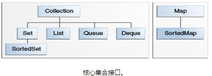

# 接口
核心集合接口封装不同类型的集合。

Map 不是真正的集合。

`public interface Collection<E>`

这种加了泛型的声明表示是通用接口。

本章讨论有效使用接口的一般准则，包括何时使用哪个接口。

为了保证核心集合接口的数量，Java 平台不为每个集合类型的每个变体提供单独的接口（如：不可变，固定大小等）。而是，每个接口中的修改操作被指定为可选 - 给定的实现可以选择不支持所有操作。如果调用了不支持的操作，则集合会抛出 UnsupportedOperationException。实现类需要记录是否可支持。所有Java平台的通用实现都支持所有可选操作。

## 核心集合接口特点

- Collection

    Collection 层次结构中的根接口。Collection 表示一组对象，这些对象也称为 collection 的元素。
    一些 collection 允许有重复的元素，而另一些则不允许。一些 collection 是有序的，而另一些则是无序的。
    JDK 不提供此接口的任何直接 实现：它提供更具体的子接口（如 Set 和 List）实现。此接口通常用来传递 collection，
    并在需要最大普遍性的地方操作这些 collection。

- Set : 不能包含重复的元素     
- List

    有序集合（有时称为序列）。List 可以包含重复的元素。通常，用户对 List 列表中每个元素的插入位置有精确的控制，
    并且可以通过它们的整数索引（position）访问元素。  

- Queue

    用于处理之前保存多个元素的集合。除了基本 Collection 操作，还提供额外的插入，提取和检查操作
    队列通常（但不一定）以 FIFO（先进先出）方式对元素排序。如优先级队列，是根据提供的比较器或元素的自然顺序来排序的。
    无论使用什么排序，队列的头都是通过调用 remove 或 poll 来移除元素
    在 FIFO 队列中，所有新元素都插入到队列的尾部。其他类型的队列可以使用不同的布局规则。
    每个 Queue 实现必须指定其排序属性。另请参阅 队列接口部分。

- Deque（双端队列）

    用于处理之前保存多个元素的集合。除了基本 Collection 操作，还提供额外的插入，提取和检查操作
    Deque 可以用作 FIFO（先进先出）和 LIFO（后进先出）。在 deque 中，所有新元素可以在两端插入，
    检索和删除。另请参阅 Deque 接口部分。

- Map 将键映射到值的对象。不能包含重复键；每个键映射一个值。

最后两个接口只是排序版本的 Set 和 Map：

- SortedSet

    Set 以升序维护其元素。提供若干附加操作以利用排序。排序集用于自然排序的集合，例如单词列表和成员资格卷。

- SortedMap
    按升序密钥维护其映射。这是 Map 模拟的 SortedSet。

    SortedMap 用于自然排序的键/值对集合，例如字典和电话目录。

    要了解排序接口如何维护元素的顺序，参阅 [对象排序部分](./objectOrdering.md)
