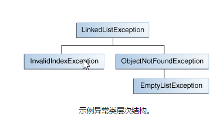

# 创建异常类

当面对选择抛出异常的类型时，您可以使用由别人编写的异常 - Java平台提供了许多可以使用的异常类 - 或者您可以编写自己的异常类。如果您对任何以下问题回答“是”，您应该编写自己的异常类; 否则，你可以使用别人的。

* 你需要一个Java平台中没有表示的异常类型吗？
* 如果他们能够区分你的异常与由其他供应商编写的类抛出的异常，它能帮助用户吗？
* 你的代码是否抛出多个相关的异常？
* 如果你使用他人的异常，用户是否可以访问这些异常？一个类似的问题是，你的包是独立的吗？

## 一个例子

假设你正在写一个链表类。该类支持以下方法：

* objectAt(int n)-返回对象n列表中的个位置。如果参数小于0或大于当前列表中的对象数，则抛出异常。
* firstObject() - 返回列表中的第一个对象。如果列表不包含对象，则抛出异常。
* indexOf(Object o)-搜索的列表中指定的Object，并返回其在列表中的位置。如果传入方法的对象不在列表中，则抛出异常。

链表类可以抛出多个异常，使用一个异常处理程序捕获链表所抛出的所有异常是很方便的。此外，如果您计划在包中分发链接列表，所有相关代码都应打包在一起。因此，链表应该提供自己的一组异常类。

下图说明了由链表抛出的异常的一种可能的类层次。

## 选择超类

任何 Exception 子类可作为 LinkedListException 的父类。然而，这些子类的，然而，快速细读这些子类的说明，发现他们不是恰当的，因为他们要么过于专业，要么与 LinkedListException 异常无关，因此 Exception 应该作为  LinkedListException 的父类。

**注：** 良好的代码，应该将 Exception 作为你的异常类的后缀名
