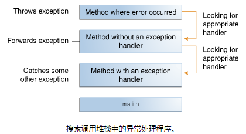

# 什么是异常
“异常事件”简称异常。

**定义：** 一个异常是一个事件，即中断了正常程序流程的指令

当在方法中发生错误时，该方法创建一个对象并将其移交给运行时系统。这个对象称为**异常对象**，包括它的类型和程序错误发生时的状态。创建一个异常对象并移交给运行系统，称为**抛出异常**

在方法抛出异常后，运行时异常尝试找到一些处理它的东西。会在一个调用方法列表中去寻找，这个方法列表称为**调用堆栈**

运行时系统在调用堆栈中搜索一个方法，该方法包含一个可以处理异常的代码块。这段程序被称为**异常处理程序**。搜索通过调用堆栈从发生错误的方法开始，并按照调用方法的相反顺序查找。当找到适当的处理程序时，运行时系统将异常传递给处理程序。如果抛出的异常对象的类型与处理程序可以处理的类型匹配，则异常处理程序被认为是适当的。

选择的异常处理程序，也就是**捕获异常**。如果运行时系统没有在调用堆栈上找到一个合适的处理程序。运行时系统因此而终止。

使用异常来管理错误，比传统的错误管理具有一定的优势，详见“异常的优点”
