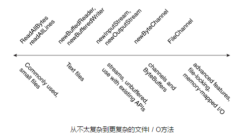

# 读、写、创建文件

此页讨论阅读、写入、创建和打开文件的详细信息。有多种文件 I/O 方法可供选择。
为了帮助理解 API，下面的图通过复杂性排列文件 I/O 方法。



最左边的常用于小文件：

* readAllBytes
* readAllLines
* write 方法

其次是 用于迭代流或文本行，如方法：

* newBufferedReader
* newBufferedWriter

再其次是无缓冲流，与 java.io 包兼容，如方法

* newInputStream
* newOutputStream

在其次是：

* newByteChannels - 方法
* SeekableByteChannels
* ByteBuffers
* ByteChannel

最后，最右边是 FileChannel 用于需要文件锁定或内存映射 I / O 的高级应用程序的方法。

！这一节感觉很难哇。通道什么的都没有怎么接触过。

**注意：** 创建新文件的方法使您能够为文件指定一组可选的初始属性。例如，在支持 POSIX 标准集（如 UNIX）的文件系统上，
您可以在创建文件时指定文件所有者，组所有者或文件权限。“ [管理元数据](./fileAttr.md)” 介绍文件属性，以及如何访问和设置它们。

本节包含以下主题：

* OpenOptions 参数
* 常用的小文件方法
* 用于文本文件的缓冲 I/O 方法
* 无缓冲流的方法并与 java.io，API 互操作（包装缓冲流）
* 通道和 ByteBuffers
* 创建常规和临时文件的方法

## OpenOptions 参数
本节中的几个方法采用可选 OpenOptions 参数。此参数是可选的，API 会告诉您，当没有指定时，该方法的默认行为是什么。

支持以下 StandardOpenOptions 枚举：

* **WRITE** – 打开文件写入访问
* **APPEND** – 将新数据追加到文件末尾。此选项与 WRITE 或 CREATE 选项一起使用。
* **TRUNCATE_EXISTING** – 将文件截断为零字节。该选项与 WRITE 选项一起使用
* **CREATE_NEW** – 创建一个新文件，如果该文件已经存在，则会引发异常。
* **CREATE** – 打开该文件（如果存在）或创建一个新的文件（如果没有）。
* **DELETE_ON_CLOSE** – 流关闭时删除文件。此选项对临时文件很有用。
* **SPARSE** – 提示新创建的文件将是稀疏的。这种高级选项在某些文件系统（如 NTFS）上得到了遵守，其中具有数据“间隙”的大型文件可以以更有效的方式存储，这些空白间隔不会占用磁盘空间。
* **SYNC** – 保留与底层存储设备同步的文件（内容和元数据）。
* **DSYNC** – 保持与底层存储设备同步的文件内容。

## 常用的小文件方法
### 从文件中读取所有字节或行

如果你有一个小的文件。你想在一个方法读取全部的内容，你可以使用
[readAllBytes(Path)](https://docs.oracle.com/javase/8/docs/api/java/nio/file/Files.html#readAllBytes-java.nio.file.Path-)或
[readAllLines(Path, Charset)](https://docs.oracle.com/javase/8/docs/api/java/nio/file/Files.html#readAllLines-java.nio.file.Path-java.nio.charset.Charset-) 方法

这些方法可以处理大部分的工作，比如打开和关闭流，但不能处理大文件。以下代码显示如何使用该 readAllBytes 方法：

```java
Path file = ...;
byte[] fileArray;
fileArray = Files.readAllBytes(file);
```

### 将所有字节或行写入文件

您可以使用一种写入方式将字节或行写入文件。

* [write(Path, byte[], OpenOption...)](https://docs.oracle.com/javase/8/docs/api/java/nio/file/Files.html#write-java.nio.file.Path-byte:A-java.nio.file.OpenOption...-)
* [write(Path, Iterable< extends CharSequence>, Charset, OpenOption...)](https://docs.oracle.com/javase/8/docs/api/java/nio/file/Files.html#write-java.nio.file.Path-java.lang.Iterable-java.nio.charset.Charset-java.nio.file.OpenOption...-)

以下代码片段显示了如何使用 write 方法。

```java
Path file = ...;
byte[] buf = ...;
Files.write(file, buf);
```

## 用于文本文件的缓冲 I/O 方法
java.nio.file 软件包支持通道 I / O，它在缓冲区中移动数据，绕过一些可能的 IO 瓶颈。

### 使用缓冲流 I / O 读取文件
[ newBufferedReader(Path, Charset)](https://docs.oracle.com/javase/8/docs/api/java/nio/file/Files.html#newBufferedReader-java.nio.file.Path-java.nio.charset.Charset-)
方法打开一个文件，返回一个 BufferedReader 可以有效地从文件中读取文本。

以下代码片段显示了如何使用该 `newBufferedReader` 方法从文件中读取。文件以 “US-ASCII” 编码。

```java
Charset charset = Charset.forName("US-ASCII");
try (BufferedReader reader = Files.newBufferedReader(file, charset)) {
    String line = null;
    while ((line = reader.readLine()) != null) {
        System.out.println(line);
    }
} catch (IOException x) {
    System.err.format("IOException: %s%n", x);
}
```

### 使用缓冲流 I / O 编写文件
您可以使用 `newBufferedWriter(Path, Charset, OpenOption...)` 方法创建一个 BufferedWriter。

```java
Charset charset = Charset.forName（"US-ASCII"）;
String s = ...;
try（BufferedWriter writer = Files.newBufferedWriter（file,charset））{
    writer.write（s,0,s.length（））;
} catch（IOException x）{
    System.err.format（"IOException：%s%n",x）;
}
```

## 无缓冲流的方法并与 java.io API 互操作

### 使用 I / O 流读取文件
要打开一个文件进行阅读，可以使用该 newInputStream(Path, OpenOption...) 方法。此方法返回一个无缓冲的输入流，用于从文件读取字节。

```java
Path file = ...;
try (InputStream in = Files.newInputStream(file);
    BufferedReader reader =
      new BufferedReader(new InputStreamReader(in))) {
    String line = null;
    while ((line = reader.readLine()) != null) {
        System.out.println(line);
    }
} catch (IOException x) {
    System.err.println(x);
}
```

## 使用 I / O 流创建和写入文件
您可以使用该 `newOutputStream(Path, OpenOption...)` 方法创建文件，附加到文件或写入文件 。
此方法打开或创建用于写入字节的文件，并返回无缓冲的输出流。

该方法采用可选 `OpenOption` 参数。如果没有指定打开的选项，并且该文件不存在，**将创建一个新的文件**。
如果文件存在，则会被截断。此选项相当于使用 `CREATE` 和 `TRUNCATE_EXISTING` options 来调用该方法。

以下示例打开日志文件。如果文件不存在，则创建它。如果文件存在，它将被打开以进行追加。

```java
import static java.nio.file.StandardOpenOption.*;
import java.nio.file.*;
import java.io.*;

public class LogFileTest {

  public static void main(String[] args) {

    // Convert the string to a
    // byte array.
    String s = "Hello World! ";
    byte data[] = s.getBytes();
    Path p = Paths.get("./logfile.txt");

    try (OutputStream out = new BufferedOutputStream(
      Files.newOutputStream(p, CREATE, APPEND))) {
      out.write(data, 0, data.length);
    } catch (IOException x) {
      System.err.println(x);
    }
  }
}
```

## Channels 和 ByteBuffers 的方法
### 使用 Channel I/O 读写文件
当流 I / O 一次读取一个字符时，通道 I / O 一次读取一个缓冲区。 `ByteChannel` 提供基本 read 和 write 功能。
`SeekableByteChannel` 是 `ByteChannel` 的子类（接口），有能力维持通道位置的和改变位置。
`SeekableByteChannel` 还支持截断与通道关联的文件，并查询文件的大小。

移动到文件中的不同点的能力，然后读取或写入该位置使文件的随机访问成为可能。更多信息参见随机访问文件。

通道 I / O 的读取和写入有两种方法。

* [newByteChannel(Path, OpenOption...)](https://docs.oracle.com/javase/8/docs/api/java/nio/file/Files.html#newByteChannel-java.nio.file.Path-java.nio.file.OpenOption...-)
* [newByteChannel(Path, Set<? extends OpenOption>, FileAttribute<?>...)](https://docs.oracle.com/javase/8/docs/api/java/nio/file/Files.html#newByteChannel-java.nio.file.Path-java.util.Set-java.nio.file.attribute.FileAttribute...-)

**注意：** 这些 `newByteChannel` 方法返回一个 `SeekableByteChannel` 实例 。使用默认文件系统，
您可以将此可搜索字节通道转换为 `FileChannel` 提供更高级功能的访问，如将文件区域直接映射到内存中，
以便更快速地访问，锁定文件的某个区域，以便其他进程无法访问该文件或读取并从绝对位置写入字节，而不影响通道的当前位置。

这两种 `newByteChannel` 方法都可以指定一个 `OpenOption` 选项列表。和 `newOutputStream` 方法一样支持使用的相同的 OpenOption （本章节的小结 - OpenOptions 参数 中有讲到），
除了还有一个选项：`READ` 是必需的，因为 `SeekableByteChannel` 支持阅读和写入。

指定 `READ` 打开通道进行阅读。指定 `WRITE` 或 `APPEND` 打开通道进行写入。如果没有指定这些选项，则打开通道进行读取。

以下代码片段读取文件并将其打印到标准输出：

```java
// 默认为READ
try (SeekableByteChannel sbc = Files.newByteChannel(file)) {
    ByteBuffer buf = ByteBuffer.allocate(10);

    // 读取具有该平台正确编码的字节
    // 如果你跳过这个步骤，你可能会看到类似乱码的字符
    String encoding = System.getProperty("file.encoding");
    while (sbc.read(buf) > 0) {
        buf.rewind(); // 限制位置不变，当前位置重置为0？ 因为上面读取后，位置已经改变
        System.out.print(Charset.forName(encoding).decode(buf));
        buf.flip(); // 相当于清空内容？位置重置？
    }
} catch (IOException x) {
    System.out.println("caught exception: " + x);
```

以下为 UNIX 和其他 POSIX 文件系统编写的示例，创建具有特定文件权限集的日志文件。
此代码创建日志文件或附加到日志文件（如果它已经存在）。创建日志文件，具有对组的所有者和只读权限的读/写权限。

```java
import static java.nio.file.StandardOpenOption.*;
import java.nio.*;
import java.nio.channels.*;
import java.nio.file.*;
import java.nio.file.attribute.*;
import java.io.*;
import java.util.*;

public class LogFilePermissionsTest {

  public static void main(String[] args) {

    // 这是操作选项，存在则追加，不存在则创建
    Set<OpenOption> options = new HashSet<OpenOption>();
    options.add(APPEND);
    options.add(CREATE);

    // 自定义权限
    Set<PosixFilePermission> perms =
      PosixFilePermissions.fromString("rw-r-----");
    FileAttribute<Set<PosixFilePermission>> attr =
      PosixFilePermissions.asFileAttribute(perms);

    // 把字符串转换为 ByteBuffer.
    String s = "Hello World! ";
    byte data[] = s.getBytes();
    ByteBuffer bb = ByteBuffer.wrap(data);

    Path file = Paths.get("./permissions.log");

    try (SeekableByteChannel sbc =
      Files.newByteChannel(file, options, attr)) {
      sbc.write(bb);
    } catch (IOException x) {
      System.out.println("Exception thrown: " + x);
    }
  }
}
```
