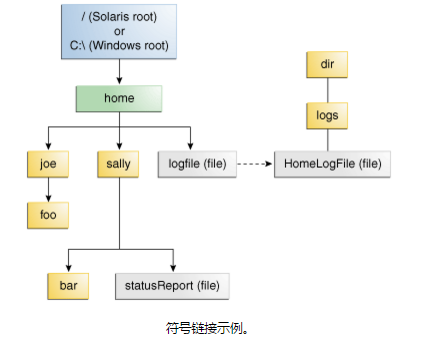

# 什么是路径？

文件系统以某种形式的媒体（通常为一个或多个硬盘驱动器）存储和组织文件，使得它们可以容易地被检索。目前使用的大多数文件系统将文件存储在树形（或分层）结构中。在树的顶部是一个（或多个）根节点。在根节点下，有文件和目录（Microsoft Windows中的文件夹）。每个目录可以包含文件和子目录，这些文件和子目录又可以包含文件和子目录，等等，可能几乎是无限的深度

本节包括以下内容：

* 什么是路径？
* 相对还是绝对？
* 符号链接

## 什么是路径？
下图显示了包含单个根节点的示例目录树。Microsoft Windows支持多个根节点。每个根节点映射到一个卷，如C:\ 或 D:\。Solaris OS支持单个根节点，以斜杠字符表示/。


通过文件系统的路径来识别文件，从根节点开始。例如，statusReport上图中的文件在Solaris操作系统中通过以下符号来描述：
```bash
/home/sally/statusReport
```
在Microsoft Windows中
```java
C:\home\sally\statusReport
```

用于分隔目录名称（也称为分隔符）的字符特定于文件系统：Solaris OS使用正斜杠（/），Microsoft Windows使用反斜杠斜杠（\）。

## 相对还是绝对？
路径是**相对**的或**绝对**的。

绝对路径始终包含找到文件所需的根元素和完整目录列表。例如，`/home/sally/statusReport`是绝对路径。找到该文件所需的所有信息都包含在路径字符串中。

相对路径需要与其他路径组合才能访问文件。例如，joe/foo是相对路径。没有更多信息，程序无法可靠地定位joe/foo文件系统中的目录。

## 符号链接
文件系统对象通常是目录或文件。每个人都熟悉这些对象。但是一些文件系统也支持符号链接的概念。也称为软链接。

一个符号链接 是引用另一个文件的 特殊的一个文件。在大多数情况下，符号链接对应用程序是透明的，符号链接的操作将自动重定向到链接的目标。（指向的文件或目录被称为**链接的目标**。）异常是当符号链接被删除或重命名时，链接本身被删除或重命名，而不是链接的目标。

在下图中，logFile似乎是一个普通的文件给用户，但它实际上是一个象征性的链接`dir/logs/HomeLogFile`。`HomeLogFile`是**链接的目标**。


符号链接通常对用户是透明的。读取或写入符号链接与读取或写入任何其他文件或目录相同。

在现实世界的场景中，大多数文件系统自由地使用符号链接。偶尔，一个不小心创建的符号链接可能导致循环引用。当链接的目标指向原始链接时，会发生循环引用。循环引用可能是间接的： 如：目录a 指向目录 b。b又指向c。c指向a。循环引用可能导致程序递归目录结构时遭到破坏。但是，这种情况已被考虑，并且不会导致您的程序无限循环。

下一节讨论java平台中文件I/O的核心类 - Path类
