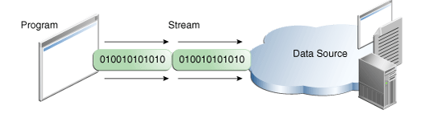

# I/O 流

一个 **I / O流** 代表输入源或输出目的地。流可以表示许多不同种类的源和目的地，包括磁盘文件，设备，其他程序和存储器阵列。

流支持许多不同类型的数据，包括简单字节，原始数据类型，本地化字符和对象。一些流简单地传递数据; 其他人以有用的方式操纵和转换数据。

无论内部工作如何，所有流都会使用与使用它们的程序相同的简单模型：流是一系列数据。程序使用 **输入流** 从源中读取数据  


程序使用 **输出流** 将数据写入目的地  



在本课中，我们将看到可以处理从原始值到高级对象的各种数据的流。

上图所示的数据源和数据目标可以是保存，生成或者消耗数据的任何东西。
显然这包括磁盘文件，但源或目的地也可以是另一个程序，外围设备，网络套接字或阵列。

在下一节中，我们将使用最基本的流字节流来演示 Stream I / O 的常见操作。
对于样本输入，我们将使用示例文件 xanadu.txt，其中包含以下内容：

```java
In Xanadu did Kubla Khan
A stately pleasure-dome decree:
Where Alph, the sacred river, ran
Through caverns measureless to man
Down to a sunless sea.
中文
```
