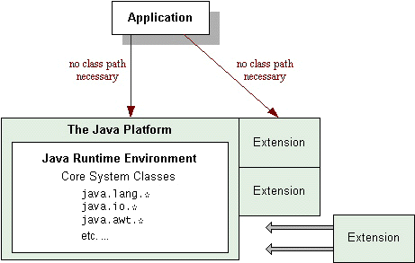

# 扩展机制
扩展机制提供了一种标准的，可扩展的方式，使 Java 平台上运行的所有应用程序都可以使用自定义 API。
_Java 扩展_（Java extensions）也称为 _可选包_。该课程中这两个术语都是表示同一个概念。

扩展是一组包和类，它们通过扩展机制扩展 Java 平台，扩展机制使运行时环境能够查找和加载扩展类，
而不必在类路径上指定扩展类。在这方面，扩展类类似于 Java 平台的核心类，
这也是扩展名的由来，实际上，扩展了平台的核心 API。

由于该机制扩展了平台的核心 API，应该明智地使用它。最常见的情况是，它用于标准化良好的接口，
如 Java 社区流程定义的接口，尽管它也适用于站点范围的接口。

如图所示，扩展充当 Java 平台的“附加”模块。它们的类和公共 api 对平台上运行的任何应用程序都是自动可用的。

扩展机制还提供了从远程位置下载扩展类以供 applet 使用的方法。

扩展被绑定为 Java Archive (JAR) 文件，本文假设您熟悉 JAR 文件格式，如果您对 JAR 文件还不了解，
那么在继续学习本文的教程之前，您可能需要回顾一些 JAR 文件文档:

- [打包 jar](../deployment/jar/)
- [jar 文件概述](https://docs.oracle.com/javase/8/docs/technotes/guides/jar/jarGuide.html)

本节有以下两个课程：

- [创建和使用扩展](./basics/)

    本节将向您展示如何向 Java 平台添加扩展，以及 applet 如何通过下载远程扩展类从扩展机制中获益。

- [使扩展安全](./security/)

    本节描述授予平台上扩展的安全特权和权限。如果您正在编写自己的扩展类，您将看到如何使用 Java 平台的安全体系结构。
- 附加文档

    您可以在 JDK 文档的 [Java 扩展机制部分](https://docs.oracle.com/javase/8/docs/technotes/guides/extensions/)中找到关于扩展的更多信息。
