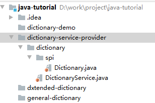

# 创建可扩展的应用程序（SPI）

一个 **可扩展** 的应用程序 **无需修改其原始代码库即可扩展**。您可以使用新的 **插件或模块增强其功能**。开发人员、软件供应商和客户可以通过将新的 Java Archive（JAR） 文件 **添加到应用程序类路径** 或到特定于应用程序的扩展目录中来添加新功能或应用程序编程接口 （API）。

本节介绍 **如何创建具有可扩展服务的应用程序**，使您或其他人可以提供 **不需要修改原始应用程序的服务实现**。通过 **设计可扩展的应用程序**，您可以在 **不更改核心应用程序** 的情况下 **提供升级或增强产品特定部分的方法**。

可扩展应用程序的一个示例是：它允许最终用户添加新的词典或拼写检查器。在此示例中，文字处理器提供了词典或拼写功能，其他开发人员甚至客户可以通过提供自己的功能实现来扩展词典或拼写功能。

**以下是对理解可扩展应用程序很重要的术语和定义：**

- Service：服务

  一组编程接口和类，提供对某些特定应用程序功能或特性的访问。服务可以定义功能的接口以及检索实现的方式。

  在文字处理器实例中，词典服务可以定义一种检索词典和单词定义的方法，但是它不实现基础功能。而是依靠**服务提供商** 来实现该功能

- Service provider interface (SPI)：服务提供商接口

  服务定义的一组公共接口和抽象类。SPI 定义了可用于您的应用程序的类和方法。

- Service Provider：服务提供商

  实现 SPI。具有可扩展服务的应用程序使您，供应商和客户无需修改原始应用程序即可添加服务提供商。

## 词典服务示例
[官方下载地址点这里](https://docs.oracle.com/javase/tutorial/ext/basics/examples/DictionaryServiceDemo/DictionaryServiceDemo.zip)，[本章官方地址](https://docs.oracle.com/javase/tutorial/ext/basics/spi.html)

::: tip

该章内容在官方上，描述可能不太容易让人看懂，这里笔者按照自己的理解的来讲解这个示例。

:::

本章不使用任何 IDEA 打包工具，全部手动使用 java 、jar 等命令完成打包和运行，因此无法进行 debug 等的观察。在实际使用中，就需要向笔者这样全部手动

该词典服务的功能是：你给定一个单词，返回该单词的定义给你；比如给出一个 「word」，程序响应 「这是一个由 4 个字母组成的词语，他的含义是」，仅仅是一个由 key 找 value 的简单演示

###  SPI 服务提供商接口：dictionary-service-provider 

该项目目录结构图：



该项目的作用是：

1. 定义 SPI 接口： Dictionary 类
2. 提供访问 Dictionary 类的一个服务提供商实现：DictionaryService

```java
package dictionary.spi;

public interface Dictionary {
    /**
     * 返回该单词的定义
     * @param word 要查找定义的单词
     * @return
     */
    public String getDefinition(String word);
}
```

```java
package dictionary;

import dictionary.spi.Dictionary;
import java.util.Iterator;
import java.util.ServiceConfigurationError;
import java.util.ServiceLoader;

/**
 * 使用任何能从类路径扫描到的 Dictionary.java 子类，并调用它的 getDefinition 方法获取该单词的定义；
 *
 * 该类是外部程序使用单词查找的 入口类
 */
public class DictionaryService {

    private static DictionaryService service;
    private ServiceLoader<Dictionary> loader;

    private DictionaryService() {
        // 这里通过接口的 class 查找目标类，使用的是默认的类加载器搜索类路径
        // 还有一个重载版本的方法 load(Class<S> service,ClassLoader loader)
        // 传入 classLoader 的方法可以让我们自定义从哪里加载类，包括如何去加载
        loader = ServiceLoader.load(Dictionary.class);
    }

    public static synchronized DictionaryService getInstance() {
        if (service == null) {
            service = new DictionaryService();
        }
        return service;
    }

    /**
     * 查找单词的定义。
     * @param word
     * @return
     */
    public String getDefinition(String word) {
        String definition = null;

        try {
            // 从类路径上找到的所有 Dictionary 实例，循环的把要查找的单词给他们处理，直到返回了结果
            Iterator<Dictionary> dictionaries = loader.iterator();
            while (definition == null && dictionaries.hasNext()) {
                Dictionary d = dictionaries.next();
                definition = d.getDefinition(word);
            }
        } catch (ServiceConfigurationError serviceError) {
            definition = null;
            serviceError.printStackTrace();
        }
        return definition;
    }
}
```

编译打包，然后供别的程序使用

```bash
# 要先进入到该项目目录下
# 编译成 class 文件，设置编译的编码，否则类里面的中文注释就会报错
dictionary-service-provider> javac -encoding utf-8 dictionary/*.java
# 打成 dictionary-service-provider.jar 包
dictionary-service-provider> jar cf dictionary-service-provider.jar dictionary/*
```

### 词典服务：dictionary-demo

项目结构图


该类的功能很简单，就是一个使用刚刚打包出来的 dictionary-service-provider.jar 中的  DictionaryService 类获取单词的定义。

由于依赖了 dictionary-service-provider.jar，我们先把他放到 libs 目录中，方便后续的打包指定路径

```java
package dictionary;

// 导入录 dictionary-service-provider.jar 包中的 DictionaryService 类
import dictionary.DictionaryService;

public class DictionaryDemo {

    public static void main(String[] args) {
        // 先获取 DictionaryService 的实例
        DictionaryService dictionary = DictionaryService.getInstance();
        // 然后给定几个单词，打印他们获取到的定义
        System.out.println(DictionaryDemo.lookup(dictionary, "book"));
        System.out.println(DictionaryDemo.lookup(dictionary, "editor"));
        System.out.println(DictionaryDemo.lookup(dictionary, "xml"));
        System.out.println(DictionaryDemo.lookup(dictionary, "REST"));
    }

    public static String lookup(DictionaryService dictionary, String word) {
        String outputString = word + ": ";
        String definition = dictionary.getDefinition(word);
        if (definition == null) {
            return outputString + "Cannot find definition for this word.";
        } else {
            return outputString + definition;
        }
    }
}

```

先编译该程序

```bash
# 编译 DictionaryDemo
# -cp 指定了他依赖的  dictionary-service-provider.jar 所在路径
dictionary-demo> javac -cp ./libs/* -encoding utf-8 dictionary/*
```

再执行它，看看会打印出什么结果？

```bash
# 运行的时候也要指定依赖的 jar 包位置
dictionary-demo> java -cp .;./libs/* dictionary/DictionaryDemo
book: Cannot find definition for this word.
editor: Cannot find definition for this word.
xml: Cannot find definition for this word.
REST: Cannot find definition for this word.
```

可以看到，现在打印出的都是找不到定义。这个是因为我们的 dictionary-service-provider 中没有一个具体的实现查找单词定义的方法。

那么我们怎么在不修改 dictionary-demo 源码的情况下，运行 dictionary-demo 让他打输出能找到单词的定义？

这就需要用到我们这章节的主角 **SPI** 来实现了，下面我们来写这个 SPI 的实现 jar 包

###  服务提供商：general-dictionary

#### 实现服务提供商

这是一个通用词典查找的服务逻辑，只实现了对 2 个单词的查找；


由于要实现 `Dictionary` 接口，所以还需要将 `dictionary-service-provider.jar` 添加到 libs 目录下，方便我们打包；

只有一个实现类，实现了如何查找单词

```java
package dictionary;

import dictionary.spi.Dictionary;

import java.util.SortedMap;
import java.util.TreeMap;

/**
 * @author John O'Conner
 */
public class GeneralDictionary implements Dictionary {

    private SortedMap<String, String> map;

    /**
     * 创建通用词典实例
     */
    public GeneralDictionary() {
        // 词典的数据源这里使用了简单的 TreeMap 来实现
        // 在实际业务中，你可以从任意地方获取：比如数据库、或则文件
        map = new TreeMap<String, String>();
        map.put(
                "book",
                "a set of written or printed pages, usually bound with " +
                        "a protective cover");
        map.put(
                "editor",
                "a person who edits");
    }

    /**
     * 实现了 Dictionary 的查找单词定义的方法。具体来处理如何查找单词
     *
     * @param word
     * @return
     */
    @Override
    public String getDefinition(String word) {
        return map.get(word);
    }

}
```

#### 注册服务提供商

要注册服务提供商，需要在 `META-INF/services` 目录下创建配置文件：

- 配置文件的名称是 **SPI 接口完全限定类名**

  表示，是为哪一个 SPI 提供服务提供商
  
- 配置文件内容是 **服务提供商的完全限定的类名**

   一行一个服务提供商，也就是说你可以实现多个。

   如果服务提供商实现类，是一个嵌套类，则在完全限定类路径后使用 `$` 符号分隔

- 配置文件编码必须为 **UTF-8** 编码

那么这里的配置文件名就是 `dictionary.spi.Dictionary`，只实现了一个服务提供者，那么就写上这一个类的路径

```
dictionary.GeneralDictionary
```

### 编译与打包

```bash
# 编译
general-dictionary> javac -cp ./libs/* -encoding utf-8 dictionary/*

# 打包
# 添加 v 参数，输出打包添加的路径
general-dictionary>jar cvf general-dictionary.jar META-INF dictionary
已添加清单
正在忽略条目META-INF/
正在添加: META-INF/services/(输入 = 0) (输出 = 0)(存储了 0%)
正在添加: META-INF/services/dictionary.spi.Dictionary(输入 = 29) (输出 = 24)(压缩了 17%)
正在添加: dictionary/(输入 = 0) (输出 = 0)(存储了 0%)
正在添加: dictionary/GeneralDictionary.class(输入 = 877) (输出 = 503)(压缩了 42%)
正在添加: dictionary/GeneralDictionary.java(输入 = 1084) (输出 = 588)(压缩了 45%)

# 上面打包后，jar 包中的目录结构如下
|- dictionary
	GeneralDictionary.class			# 重要的是要打包 .class 文件
	GeneralDictionary.java			# 前面说过，java 源码文件打包进来可以忽略不影响
|- META-INF
	|- services
		dictionary.spi.Dictionary
```

实现了一个服务提供商，那么下面我们来使用下这个服务器提供商

### 服务提供商的使用

我们回到 dictionary-demo 项目，前面说过，通过 SPI 不需要修改源码，即可实现功能的扩展。

这里我们要把 上面实现的通用词典搜索功能的 jar 包 general-dictionary.jar，**复制到  dictionary-demo/lib 下**。在运行的时候，**才能 让 SPI 扫描到这个通用的词典搜索服务商**

然后我们直接运行  dictionary-demo

```bash
dictionary-demo> java -cp .;./libs/* dictionary/DictionaryDemo
book: a set of written or printed pages, usually bound with a protective cover
editor: a person who edits
xml: Cannot find definition for this word.
REST: Cannot find definition for this word.
```

可以看到，我们新增的服务提供商被使用了，然而我们并没有修改源码；

这里就可以想到一些使用场景了：

- 在你做一个中间件的时候，也可以提供类似的机制，让使用的人能够扩展功能
- 可以传入自己的类加载器，完成更复杂的类加载，比如：
  - 可以指定一个固定的目录，和语法去加载
  - 还可以通过程序实现不重启程序加载

然后我们再按照上面的服务提供商，再来提供一个搜索服务功能。

### 服务提供商：dxtended-dictionary

对于这个服务提供商的实现思路，和  general-dictionary 完全一样，我就不细致描述了

#### 实现服务提供商

```java
package dictionary;

import dictionary.spi.Dictionary;
import java.util.SortedMap;
import java.util.TreeMap;

/**
 *
 * @author John O'Conner
 */
public class ExtendedDictionary implements Dictionary {

        private SortedMap<String, String> map;

    /**
     * Creates a new instance of ExtendedDictionary
     */
    public ExtendedDictionary() {
        map = new TreeMap<String, String>();
        map.put(
            "xml",
            "a document standard often used in web services, among other " +
                "things");
        map.put(
            "REST",
            "an architecture style for creating, reading, updating, " +
                "and deleting data that attempts to use the common " +
                "vocabulary of the HTTP protocol; Representational State " +
                "Transfer");
    }

    @Override
    public String getDefinition(String word) {
        return map.get(word);
    }

}

```

#### 注册服务提供商

`META-INF/services/dictionary.spi.Dictionary`

```
dictionary.ExtendedDictionary
```

#### 打包

```bash
dxtended-dictionary> javac -cp ./libs/* -encoding utf-8 dictionary/*
dxtended-dictionary> jar cf dxtended-dictionary.jar META-INF dictionary
```

### 多个服务提供商使用

同样把新增的服务提供商 dxtended-dictionary.jar 复制到 `dictionary-demo/libs` 下，那么现在  `dictionary-demo/libs` 目录下的文件就有 1 个 SPI 服务接口包、两个 SPI 服务商

```
dictionary-service-provider.jar
dxtended-dictionary.jar
general-dictionary.jar
```

运行查看效果

```bash
dictionary-demo> java -cp .;./libs/* dictionary/DictionaryDemo
book: a set of written or printed pages, usually bound with a protective cover
editor: a person who edits
xml: a document standard often used in web services, among other things
REST: an architecture style for creating, reading, updating, and deleting data that attempts to use the common vocabulary of the HTTP protocol; Representational State Transfer

```

可以看到也被使用了

## ServiceLoader 类

java.util.ServiceLoader 类可帮助您 **查找、加载和使用服务提供商**。它在应用程序的 **类路径或运行时环境的扩展目录** 中搜索服务提供商。它加载它们，并使应用程序能够使用提供程序的 API。如果将新提供程序添加到类路径或运行时扩展目录，则 ServiceLoader 类将找到它们。如果您的应用程序知道提供者接口，那么它可以找到并使用该接口的不同实现。您可以使用该接口的第一个可加载实例，或遍历所有可用接口。

ServiceLoader 类是 final 的，所以不能重写他，以实现从其他位置搜索服务。

从 ServiceLoader 类的角度来看，所有服务都有一个类型，通常是单个 **接口或抽象类**。提供程序本身包含一个或多个具体类，这些类使用特定于其用途的实现扩展服务类型。ServiceLoader 类要求这些提供的类 **有默认构造函数**，该构造函数不需要参数。这使 **ServiceLoader 类能够轻松实例化它** 找到的服务提供者。

**该类还提供了缓存功能**：每此调用 ServiceLoader.load 方法，都会返回一个新的 ServiceLoader 实例，当调用 `loader.iterator()` 获取服务实例时，他们会被存储在缓存中，你可以调用 `reload()` 方法清空缓存。

要为特定的类创建加载器，请将类本身提供给 `load` 或 `loadInstalled` 方法。您可以使用默认的类加载器，也可以提供自己的 `ClassLoader` 子类。

## ServiceLoader API的局限性

ServiceLoader API 很有用，但是有局限性，例如：

- 不能从继承 ServiceLoader  以改变他的行为；

  但是可以使用自定义 ClassLoader 子类来更改找到类的方式

- ServiceLoader 无法在程序运行时，检测到有新的服务类加入

- 也无法将监听器加到  ServiceLoader 上，来监听合适有新的服务加入到特定的目录

ServiceLoader  在 JDK 6 + 中才提供公共的 API 方法，在这之前，虽然该类已经存在，但是方法是私有的，仅供 java 内部使用

## 总结

创建可扩展应用程序的最简单方法是使用  ServiceLoader，使用此类将提供程序实现加到应用程序类路径中，以使其新功能可用。

下面来总结下如何创建一个可扩展程序的步骤：

1. 提供一个 SPI 接口
2. 使用 ServiceLoader 扫描该接口的服务提供商程序
3. 编写服务提供商程序
   1. 实现 SPI 接口
   2. 注册服务提供商

