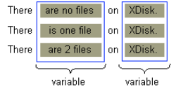

# 处理复数

如果单词的复数形式和单数形式都是可能的，那么信息中的单词可能会有所不同。通过 ChoiceFormat 类，可以将数字映射到单词或短语，从而构造语法正确的信息。

在英语中，一个单词的复数形式和单数形式通常是不同的。在构建引用数量的信息时，这可能会出现问题。
例如，如果您的信息报告磁盘上的文件数量，以下变化是可能的:

```
There are no files on XDisk.
There is one file on XDisk.
There are 2 files on XDisk.
```

解决此问题的最快方法是创建如下 `MessageFormat` 模式：

```
There are {0,number} file(s) on {1}.
```

不幸的是，前面的模式导致了错误的语法:

```
There are 1 file(s) on XDisk.
```

如果使用 ChoiceFormat 类，则可以做得更好。在本节中，您将通过一个示例程序来学习如何处理信息中的复数。这个程序还使用 MessageFormat 类处理复合信息，这个类在前一节中已经讨论过。

## 1. 自定义信息模式

首先确定信息中的变量



接下来，用参数替换信息中的变量，创建可以应用于 `MessageFormat` 对象的模式：

```
There {0} on {1}.
```

`{1}` 对应的磁盘名称很容易处理。而 `{0}` 则更为复杂，原因有两个：

- 此参数所替换的短语随文件的数量而变化。

  要在运行时构造这个短语，需要将文件的数量映射到特定的字符串。

  例如，数字 1 将映射到包含短语的字符串是 ``is one file` 。ChoiceFormat 类允许您执行必要的映射。

- 如果磁盘包含多个文件，则短语包含一个整数。MessageFormat 类允许您在短语中插入数字。

## 2. 创建 ResourceBundle

因为必须翻译信息文本，所以将其分隔为  ResourceBundle

```java
ResourceBundle bundle = ResourceBundle.getBundle("ChoiceBundle", currentLocale);
```

使用  ChoiceBundle_en_US.properties 来保存信息文本

```
pattern = There {0} on {1}.
noFiles = are no files
oneFile = is one file
multipleFiles = are {2} files
```

此文件第一行是 MessageFormat 模式，其他行包含替换模式中参数编号的短语，multipleFiles 中的参数编号将被一个数字替换

## 3. 创建  MessageFormat

创建 MessageFormat 并设置 Locale

```java
MessageFormat messageForm = new MessageFormat("");
messageForm.setLocale(currentLocale);
```

## 4. 创建  ChoiceFormat

ChoiceFormat 对象允许您基于 double 类型的数值选择特定的字符串。double 数字的范围和它们映射到的字符串对象在数组中指定:

```java
double[] fileLimits = {0,1,2};
String [] fileStrings = {
    bundle.getString("noFiles"),
    bundle.getString("oneFile"),
    bundle.getString("multipleFiles")
};
```

fileLimits 和 fileStrings 的索引一一对应，当传入的数值是 1 时，将返回 `bundle.getString("oneFile")` 的值

```java
ChoiceFormat choiceForm = new ChoiceFormat(fileLimits, fileStrings);
```

## 5. 应用模式

```java
String pattern = bundle.getString("pattern");
messageForm.applyPattern(pattern);
```

## 6. 分配格式


```java
Format[] formats = {choiceForm, null, NumberFormat.getInstance()};
messageForm.setFormats(formats);
```

setFormats 方法将格式对象分配给 **信息模式中的参数**。在调用 setFormats 方法之前，必须先调用 applyPattern 方法。

下表显示了格式数组的元素与信息模式中的参数的对应关系:

| Array Element                | Pattern Argument |
| ---------------------------- | ---------------- |
| `choiceForm`                 | `{0}`            |
| `null`                       | `{1}`            |
| `NumberFormat.getInstance()` | `{2}`            |

## 7. 设置参数并设置信息格式

```java
Object[] messageArguments = {null, "XDisk", null};

// 随机 4 次，看看对两个数字格式化后的信息
for (int numFiles = 0; numFiles < 4; numFiles++) {
    messageArguments[0] = new Integer(numFiles);
    messageArguments[2] = new Integer(numFiles);
    String result = messageForm.format(messageArguments);
    System.out.println(result);
}
```

## 完整程序

ChoiceBundle_en_US.properties 在前面已经存在了

ChoiceBundle_zh_CN.properties

```
pattern = {0} 在 {1} 上.
noFiles = 没有文件
oneFile = 有一个文件
multipleFiles = 有 {2} 文件
```

```java
public class ChoiceFormatDemo {

    static void displayMessages(Locale currentLocale) {

        System.out.println("currentLocale = " + currentLocale.toString());
        System.out.println();

        ResourceBundle bundle =
                ResourceBundle.getBundle("ChoiceBundle", currentLocale);

        MessageFormat messageForm = new MessageFormat("");
        messageForm.setLocale(currentLocale);

        // 与之前不一样的来了，创建 ChoiceFormat
        // 设置值 与对应的文案映射
        // 每个值对应一个文案
        double[] fileLimits = {0, 1, 2};

        String[] fileStrings = {
                bundle.getString("noFiles"),
                bundle.getString("oneFile"),
                bundle.getString("multipleFiles")
        };

        ChoiceFormat choiceForm = new ChoiceFormat(fileLimits, fileStrings);

        String pattern = bundle.getString("pattern");

        // 构建 format，这里按索引对应与 参数编号 的格式化处理方式。
        // 注意这里：不是按参数编号，如果你的参数编号不是按顺序的信息，
        // 比如下面的模式是按 {0} {1} {2} ，但是你信息里面写的是  {1} {0} {2}
        // 那么在获取参数的时候，能获取到对应编号的参数，但是：获取格式化的时候，它是按照当前处理的索引占位顺序来获取的
        // 比如这里的 {1} 对应的参数是  XDisk, 那么将获取 choiceForm 来处理（因为处理占位符的顺序是 0），将会异常
        // 每个参数编号都要指定
        Format[] formats = {choiceForm, null, NumberFormat.getInstance()};

        messageForm.applyPattern(pattern);
        messageForm.setFormats(formats);

        // 构建参数参数列表，并格式化
        Object[] messageArguments = {null, "XDisk", null};

        for (int numFiles = 0; numFiles < 4; numFiles++) {
            messageArguments[0] = new Integer(numFiles);
            messageArguments[2] = new Integer(numFiles);
            String result = messageForm.format(messageArguments);
            System.out.println(result);
        }
    }

    static public void main(String[] args) {
        displayMessages(new Locale("en", "US"));
        System.out.println();
        displayMessages(new Locale("zh", "CN"));
    }
}
```

测试输出

```
currentLocale = en_US

There are no files on XDisk.
There is one file on XDisk.
There are 2 files on XDisk.
There are 3 files on XDisk.

currentLocale = zh_CN

没有文件 在 XDisk 上.
有一个文件 在 XDisk 上.
有 2 文件 在 XDisk 上.
有 3 文件 在 XDisk 上.
```

注意一个坑：上面代码中写了很长一段的解释说明的原因是：

```
# 我想把现在的中文模式
pattern = {0} 在 {1} 上.
# 换成这样的
pattern = 在 {1} 上 {0}。

有一个文件 在 XDisk 上. 更符合中文的含义是，在 XDisk 上有一个文件。
```

注意，这个顺序变了。总结如下：

- 只使用  MessageFormat ，**参数的索引是和 文本信息中的参数编号对应的**，而不管参数编号在文件中的出现顺序是什么
- 如果使用 ChoiceFormat 的话，**参数编号的出现顺序**，必须和 **setFormats 指定的顺序一致**，个人觉得这个就是一个 BUG