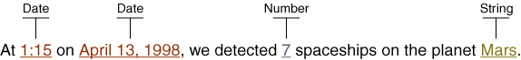

# 处理复合信息

复合信息可以包含几种类型的变量：日期、时间、字符串、数字、货币和百分比。要以与 Locale 无关的方式格式化复合信息，需要构造一个模式，将其应用于 MessageFormat 对象，并将此模式存储在 ResourceBundle 中。

下面通过一个示例程序来讲解如何使用，完整示例程序在最后贴出

## 1. 识别信息中的变量

假设要国际化以下信息



上图显示了哪些是变量，并且数据类型是什么

## 2. 隔离  ResourceBundle 中的信息模式

将信息存储在 MessageBundle 中

```java
ResourceBundle messages =
   ResourceBundle.getBundle("MessageBundle", currentLocale);
```

为 en_US 翻译的信息文件 MessageBundle_en_US.properties

```
template = At {2,time,short} on {2,date,long}, \
    we detected {1,number,integer} spaceships on \
    the planet {0}.
planet = Mars
```

template 就是一个信息模式，如果将此模式与步骤 1 中显示的信息文本进行比较，将看到用 **大括号括起来的参数** 替换信息文本中的每个变量。

每个参数都以一个称为 **参数号的数字开头**，它与保存 **参数值的对象数组中的元素的索引** 相匹配。注意，在模式中，参数号没有任何特定的顺序。您可以将参数放在模式中的任何位置。惟一的要求是参数号在参数值数组中有一个匹配的元素。

下面解释下每个模式中的参数

| Argument             | Description                                                  |
| -------------------- | ------------------------------------------------------------ |
| `{2,time,short}`     | Date 对象的时间部分， `short` 表示使用 `DateFormat.SHORT` 来格式化时间 |
| `{2,date,long}`      | Date 对象的日期部分，Date 日期和时间都使用相同的对象。在 Object 参数数组中，该 Date 对象元素索引为 2。 |
| `{1,number,integer}` | 一个  `Number` 对象，进一步使用  `integer`  来限定格式化     |
| `{0}`                | 在`ResourceBundle`对应于`planet`关键。                       |

## 3. 设置信息参数

为 template 构建参数数组，按照模式中的参数号进行构建

```java
Object[] messageArguments = {
    messages.getString("planet"),
    new Integer(7),
    new Date()
};
```

## 4. 创建格式化程序

创建 MessageFormat 对象，设置 Locale 是因为该信息包含 Date 和 Number 对象，应该对 Locale 敏感的方式进行格式化

```java
MessageFormat formatter = new MessageFormat("");
formatter.setLocale(currentLocale);
```

## 5. 使用模式和参数格式化信息

将信息模式传递给  MessageFormat ，进行格式化时，传递信息参数数组，返回一个格式化后的信息文本

```java
formatter.applyPattern(messages.getString("template"));
String output = formatter.format(messageArguments);
```

## 完整程序示例

MessageBundle_zh_CN.properties

```
template = {2,date,long}{2,time,short} , \
    我们在{0}上发现有 {1,number,integer} 架宇宙飞船在飞行
planet = 火星
```

MessageBundle_en_US.properties 的内容在前面已经列出过了

```java
import java.util.*;
import java.text.*;

public class MessageFormatDemo {

    static void displayMessage(Locale currentLocale) {

        System.out.println("currentLocale = " + currentLocale.toString());
        System.out.println();

        ResourceBundle messages =
                ResourceBundle.getBundle("MessageBundle", currentLocale);

        // 构建信息参数数组
        Object[] messageArguments = {
                messages.getString("planet"),
                new Integer(7),
                new Date()
        };

        MessageFormat formatter = new MessageFormat("");
        // 指定使用 Locale
        formatter.setLocale(currentLocale);

        // 给定信息中的复合信息模式（模板）
        formatter.applyPattern(messages.getString("template"));
        String output = formatter.format(messageArguments);

        System.out.println(output);

    }

    static public void main(String[] args) {
        displayMessage(new Locale("en", "US"));
        System.out.println();
        displayMessage(new Locale("zh", "CN"));
    }
}

```

测试输出

```
currentLocale = en_US

At 11:58 AM on July 17, 2020, we detected 7 spaceships on the planet Mars.

currentLocale = zh_CN

2020年7月17日下午12:00 , 我们在火星上发现有 7 架宇宙飞船在飞行
```

