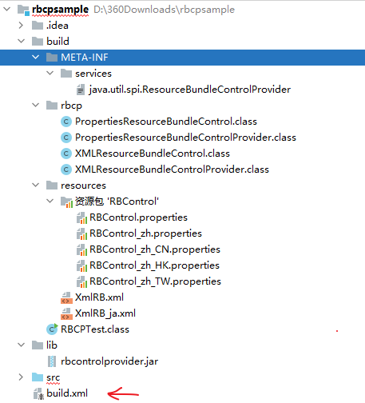

# 将自定义资源包作为扩展安装

[自定义资源包加载](../resbundle/control.md) 部分，向您展示了如何更改 ResourceBundle 的加载方式。这涉及从 [`ResourceBundle.Control`](https://docs.oracle.com/javase/8/docs/api/java/util/ResourceBundle.Control.html) 派生一个新类，然后通过调用以下方法来检索 ResourceBundle：

```java
ResourceBundle getBundle(
  String baseName,
  Locale targetLocale,
  ResourceBundle.Control control)
```

上述方法参数 control 是您对 `ResourceBundle.Control` 的实现

[`java.util.spi.ResourceBundleControlProvider`](https://docs.oracle.com/javase/8/docs/api/java/util/spi/ResourceBundleControlProvider.html) 接口允许您改变以下方法加载 ResourceBundle:

```java
ResourceBundle getBundle(
  String baseName,
  Locale targetLocale)
```

请注意，此版本的  [`ResourceBundle.getBundle`](https://docs.oracle.com/javase/8/docs/api/java/util/ResourceBundle.html#getBundle-java.lang.String-java.util.Locale-) 方法不需要 `ResourceBundle.Control` 类的实例。`ResourceBundleControlProvider`是服务提供商接口（SPI）。SPI 使您能够创建可扩展的应用程序，这些应用程序可以在不修改其原始代码库的情况下轻松扩展。有关更多信息，请参见 [创建可扩展应用程序](/ext/basics/spi.md)。

RBCPTest 示例，演示了如何实现 `ResourceBundleControlProvider` 接口，并将其作为扩展安装，该示例有点复杂，官网压缩包下载地址 [RBCPTest.zip](https://docs.oracle.com/javase/tutorial/i18n/serviceproviders/examples/rbcpsample/RBCPTest.zip)：结构如下

- ```
  src
  ```

  - [`java.util.spi.ResourceBundleControlProvider`](https://docs.oracle.com/javase/tutorial/i18n/serviceproviders/examples/rbcpsample/src/java.util.spi.ResourceBundleControlProvider)

  - [`RBCPTest.java`](https://docs.oracle.com/javase/tutorial/i18n/serviceproviders/examples/rbcpsample/src/RBCPTest.java)

  - ```
    rbcp
    ```

    - [`PropertiesResourceBundleControl.java`](https://docs.oracle.com/javase/tutorial/i18n/serviceproviders/examples/rbcpsample/src/rbcp/PropertiesResourceBundleControl.java)
    - [`PropertiesResourceBundleControlProvider.java`](https://docs.oracle.com/javase/tutorial/i18n/serviceproviders/examples/rbcpsample/src/rbcp/PropertiesResourceBundleControlProvider.java)
    - [`XMLResourceBundleControl.java`](https://docs.oracle.com/javase/tutorial/i18n/serviceproviders/examples/rbcpsample/src/rbcp/XMLResourceBundleControl.java)
    - [`XMLResourceBundleControlProvider.java`](https://docs.oracle.com/javase/tutorial/i18n/serviceproviders/examples/rbcpsample/src/rbcp/XMLResourceBundleControlProvider.java)

  - ```
    resources
    ```

    - [`RBControl.properties`](https://docs.oracle.com/javase/tutorial/i18n/serviceproviders/examples/rbcpsample/src/resources/RBControl.properties)
    - [`RBControl_zh.properties`](https://docs.oracle.com/javase/tutorial/i18n/serviceproviders/examples/rbcpsample/src/resources/RBControl_zh.properties)
    - [`RBControl_zh_CN.properties`](https://docs.oracle.com/javase/tutorial/i18n/serviceproviders/examples/rbcpsample/src/resources/RBControl_zh_CN.properties)
    - [`RBControl_zh_HK.properties`](https://docs.oracle.com/javase/tutorial/i18n/serviceproviders/examples/rbcpsample/src/resources/RBControl_zh_HK.properties)
    - [`RBControl_zh_TW.properties`](https://docs.oracle.com/javase/tutorial/i18n/serviceproviders/examples/rbcpsample/src/resources/RBControl_zh_TW.properties)
    - [`XmlRB.xml`](https://docs.oracle.com/javase/tutorial/i18n/serviceproviders/examples/rbcpsample/src/resources/XmlRB.xml)
    - [`XmlRB_ja.xml`](https://docs.oracle.com/javase/tutorial/i18n/serviceproviders/examples/rbcpsample/src/resources/XmlRB_ja.xml)

- ```
  lib
  ```

  - [`rbcontrolprovider.jar`](https://docs.oracle.com/javase/tutorial/i18n/serviceproviders/resourcebundlecontrolprovider.html#package-provider)

- `build`：包含所有打包的文件`rbcontrolprovider.jar`以及类文件`RBCPTest.class`

- [`build.xml`](https://docs.oracle.com/javase/tutorial/i18n/serviceproviders/examples/rbcpsample/build.xml)

这个 build.xm 打包使用的是 Apache Ant，我尝试使用 gradle 来打包，是可以做到打出来的 jar 包和这里要求的结构一致，唯一有一点无法实现，就是无法边写边测试，只能写完，打包后，通过他指定的加载路径进行测试。 这里还是使用手动方式进行打包来演示

以上示例程序分为以下几个步骤：

1. 创建  ResourceBundle.Control 实现类
2. 实现  ResourceBundleControlProvider 接口
3. 编写测试程序调用 `ResourceBundle.getBundle` 方法
4. 通过创建配置文件来注册服务提供商
5. 打包编写好的 SPI 程序
6. 运行 RBCPTest 程序

## 1. 创建  ResourceBundle.Control 实现类

- XMLResourceBundleControl：基于  [`Properties.loadFromXML`](https://docs.oracle.com/javase/8/docs/api/java/util/Properties.html#loadFromXML-java.io.InputStream-) 方法加载 xml 资源
- PropertiesResourceBundleControl.java ：与  [自定义资源包加载](../resbundle/control.html) 中的实现一致

PropertiesResourceBundleControl

```java
package rbcp;

import java.util.Arrays;
import java.util.List;
import java.util.Locale;
import java.util.ResourceBundle;

public class PropertiesResourceBundleControl extends ResourceBundle.Control {

    @Override
    public List<Locale> getCandidateLocales(String baseName, Locale locale) {
        if (baseName == null)
            throw new NullPointerException();
        if (locale.equals(new Locale("zh", "HK"))) {
            return Arrays.asList(
                    locale,
                    Locale.TAIWAN,
                    // no Locale.CHINESE here
                    Locale.ROOT);
        } else if (locale.equals(Locale.TAIWAN)) {
            return Arrays.asList(
                    locale,
                    // no Locale.CHINESE here
                    Locale.ROOT);
        }
        return super.getCandidateLocales(baseName, locale);
    }
}
```
对应的资源文件如下:

RBControl.properties

```
region: global
language: English
```

RBControl_zh.properties

```
language: Simplified Chinese
```

RBControl_zh_CN.properties

```
region: China
```

RBControl_zh_HK.properties

```
region: Hong Kong
```

RBControl_zh_TW.properties

```
region: Taiwan
language: Traditional Chinese
```


XMLResourceBundleControl


```java
package rbcp;

import java.io.*;
import java.net.*;
import java.util.*;

import static java.util.ResourceBundle.Control.*;

public class XMLResourceBundleControl extends ResourceBundle.Control {
    @Override
    public List<String> getFormats(String baseName) {
        if (baseName == null) {
            throw new NullPointerException();
        }
        return Arrays.asList("xml");
    }

    @Override
    public ResourceBundle newBundle(String baseName, Locale locale,
                                    String format,
                                    ClassLoader loader,
                                    boolean reload)
            throws IllegalAccessException,
            InstantiationException, IOException {
        if (baseName == null || locale == null
                || format == null || loader == null) {
            throw new NullPointerException();
        }
        ResourceBundle bundle = null;
        if (format.equals("xml")) {
            String bundleName = toBundleName(baseName, locale);
            String resourceName = toResourceName(bundleName, format);
            URL url = loader.getResource(resourceName);
            if (url != null) {
                URLConnection connection = url.openConnection();
                if (connection != null) {
                    if (reload) {
                        // disable caches if reloading
                        connection.setUseCaches(false);
                    }
                    try (InputStream stream = connection.getInputStream()) {
                        if (stream != null) {
                            BufferedInputStream bis =
                                    new BufferedInputStream(stream);
                            bundle = new XMLResourceBundle(bis);
                        }
                    }
                }
            }
        }
        return bundle;
    }

    private static class XMLResourceBundle extends ResourceBundle {
        private Properties props;

        XMLResourceBundle(InputStream stream) throws IOException {
            props = new Properties();
            props.loadFromXML(stream);
        }

        protected Object handleGetObject(String key) {
            if (key == null) {
                throw new NullPointerException();
            }
            return props.get(key);
        }

        public Enumeration<String> getKeys() {
            // Not implemented
            return null;
        }
    }
}
```

对应的资源文件如下：

XmlRB.xml

```xml
<!--  DTD for properties  -->
<properties version="1.0">
    <comment>Test data for RBCPTest.java</comment>
    <entry key="type">XML</entry>
</properties>
```

XmlRB_ja.xml

```xml
<!--  DTD for properties  -->
<properties version="1.0">
    <comment>Test data for RBCPTest.java, Japan locale</comment>
    <entry key="type">Value from Japan locale</entry>
</properties>
```

xml 中的 entry 对应了 properties 中的一行一个 key、value 的概念。其他的如下说明：

- DOCTYPE 声明：用于指定文档类型定义（DTD），DTD 定义 XML 文件的结构，可以使用如下声明

  ```xml
  <!DOCTYPE properties SYSTEM "http://java.sun.com/dtd/properties.dtd">  
  ```

- `<properties>`：元素是根元素，包含所有其他元素

- `<comment>`：是注释元素，用于说明信息

- `<entry>`：对应 properties 中的 key、value，任意数量

有关 XML 属性文件的更多信息，请参见 [`Properties`](https://docs.oracle.com/javase/8/docs/api/java/util/Properties.html) 类。

## 2. 实现  ResourceBundleControlProvider 接口

上述实现了两个  ResourceBundle.Control 类，这里也有两个 ResourceBundleControlProvider  的实现类

- PropertiesResourceBundleControlProvider

- XMLResourceBundleControlProvider

PropertiesResourceBundleControlProvider

```java
package rbcp;

import java.util.ResourceBundle;
import java.util.spi.ResourceBundleControlProvider;

public class PropertiesResourceBundleControlProvider
        implements ResourceBundleControlProvider {
    static final ResourceBundle.Control PROPERTIESCONTROL =
            new PropertiesResourceBundleControl();

    public ResourceBundle.Control getControl(String baseName) {
        System.out.println("Class: " + getClass().getName() + ".getControl");
        System.out.println("    called for " + baseName);

        // Throws a NPE if baseName is null.
        if (baseName.startsWith("resources.RBControl")) {
            System.out.println("    returns " + PROPERTIESCONTROL);
            return PROPERTIESCONTROL;
        }
        System.out.println("    returns null");
        System.out.println();
        return null;
    }
}
```

这里检查了资源名称是否是 `resources.RBControl` 开头，这是因为  RBControl.properties 的资源包文件，都在  `resources` 目录下，确认是该资源名称后，返回了前面实现的  `PropertiesResourceBundleControl` 类

XMLResourceBundleControlProvider

```java
package rbcp;

import java.util.ResourceBundle;
import java.util.spi.ResourceBundleControlProvider;

public class XMLResourceBundleControlProvider
        implements ResourceBundleControlProvider {
    static final ResourceBundle.Control XMLCONTROL =
            new XMLResourceBundleControl();

    public ResourceBundle.Control getControl(String baseName) {
        System.out.println("Class: " + getClass().getName()+".getControl");
        System.out.println("    called for " + baseName);

        // Throws a NPE if baseName is null.
        if (baseName.startsWith("resources.Xml")) {
            System.out.println("    returns " + XMLCONTROL);
            return XMLCONTROL;
        }
        System.out.println("    returns null");
        System.out.println();
        return null;
    }
}
```

对于 xml 也一行，同样是判定资源名称，并返回了前面实现的 XMLResourceBundleControl 实例

## 3. 编写测试程序调用 `ResourceBundle.getBundle` 方法

RBCPTest

```java
import java.io.*;
import java.net.*;
import java.util.*;

public class RBCPTest {
    public static void main(String[] args) {
        ResourceBundle rb = ResourceBundle.getBundle("resources.XmlRB", Locale.ROOT);
        String type = rb.getString("type");
        System.out.println("Root locale. Key, type: " + type);
        System.out.println();

        rb = ResourceBundle.getBundle("resources.XmlRB", Locale.JAPAN);
        type = rb.getString("type");
        System.out.println("Japan locale. Key, type: " + type);
        System.out.println();

        test(Locale.CHINA);
        test(new Locale("zh", "HK"));
        test(Locale.TAIWAN);
        test(Locale.CANADA);
    }

    private static void test(Locale locale) {
        ResourceBundle rb = ResourceBundle.getBundle(
                "resources.RBControl", locale);
        System.out.println("locale: " + locale);
        System.out.println("    region: " + rb.getString("region"));
        System.out.println("    language: " + rb.getString("language"));
        System.out.println();
    }
}
```

这里要加载 `resources.XmlRB`，也就是 resources 目录下的 `XmlRB.xml`  文件，通过 SPI 方式，会加载到刚刚我们提供的 SPI 实现。要实现让 jdk 运行时加载我们的扩展，还需要通过配置文件来声明 SPI 实现;

注意：这个类里面并没有 PropertiesResourceBundleControl.java 之类的引用，是通过 SPI 机制来实现不修改代码，达到的。

## 4. 通过创建配置文件来注册服务提供商

配置文件的名称是提供程序实现的接口或类的标准名称。配置文件包含提供程序的完全限定的类名

java.util.spi.ResourceBundleControlProvider 文件，就表示要对 `java.util.spi.ResourceBundleControlProvider` 接口进行 SPI 实现，文件内容如下

```
rbcp.XMLResourceBundleControlProvider
rbcp.PropertiesResourceBundleControlProvider
```

一行一个我们实现的 SPI 程序提供者类，完全限定名。

该文件位置，必须在指定的 `META-INF/services` 目录下，在打包时指定。

## 5. 打包编写好的 SPI 程序

运行以下命令编译程序到  build 目录下

```
javac -d build src/java.* src/rbcp/*.java
```

然后打成 jar 包，jar 包目录结构如下

- ```
  META-INF
  ```

  - ```
    services
    ```

    - `java.util.spi.ResourceBundleControlProvider`

- ```
  rbcp
  ```

  - `PropertiesResourceBundleControl.class`
  - `PropertiesResourceBundleControlProvider.class`
  - `XMLResourceBundleControl.class`
  - `XMLResourceBundleControlProvider.class`

- ```
  resources
  ```

  - `RBControl.properties`
  - `RBControl_zh.properties`
  - `RBControl_zh_CN.properties`
  - `RBControl_zh_HK.properties`
  - `RBControl_zh_TW.properties`
  - `XmlRB.xml`
  - `XmlRB_ja.xml`

有关如何手动打 jar 包，前面几章也有讲解，也可以参考这个专题知识 [打包 jar](/deployment/jar/)

## 6. 运行 RBCPTest 程序

手动包后，的目录结构如下：



然后可以进入到项目根目录运行如下命令：

```
java -Djava.ext.dirs=lib -cp build RBCPTest
```

原理就是通过 `-D` 指定环境变量，来加载我们实现的 rbcontrolprovider.jar，就不用手动放到指定的目录下了，运行后，输出信息如下

```
Class: rbcp.XMLResourceBundleControlProvider.getControl
    called for resources.XmlRB
    returns rbcp.XMLResourceBundleControl@74a14482
Root locale. Key, type: XML

Class: rbcp.XMLResourceBundleControlProvider.getControl
    called for resources.XmlRB
    returns rbcp.XMLResourceBundleControl@74a14482
Japan locale. Key, type: Value from Japan locale

Class: rbcp.XMLResourceBundleControlProvider.getControl
    called for resources.RBControl
    returns null

Class: rbcp.PropertiesResourceBundleControlProvider.getControl
    called for resources.RBControl
    returns rbcp.PropertiesResourceBundleControl@7ea987ac
locale: zh_CN
    region: China
    language: Simplified Chinese

Class: rbcp.XMLResourceBundleControlProvider.getControl
    called for resources.RBControl
    returns null

Class: rbcp.PropertiesResourceBundleControlProvider.getControl
    called for resources.RBControl
    returns rbcp.PropertiesResourceBundleControl@7ea987ac
locale: zh_HK
    region: Hong Kong
    language: Traditional Chinese

Class: rbcp.XMLResourceBundleControlProvider.getControl
    called for resources.RBControl
    returns null

Class: rbcp.PropertiesResourceBundleControlProvider.getControl
    called for resources.RBControl
    returns rbcp.PropertiesResourceBundleControl@7ea987ac
locale: zh_TW
    region: Taiwan
    language: Traditional Chinese

Class: rbcp.XMLResourceBundleControlProvider.getControl
    called for resources.RBControl
    returns null

Class: rbcp.PropertiesResourceBundleControlProvider.getControl
    called for resources.RBControl
    returns rbcp.PropertiesResourceBundleControl@7ea987ac
locale: en_CA
    region: China
    language: Simplified Chinese

```

