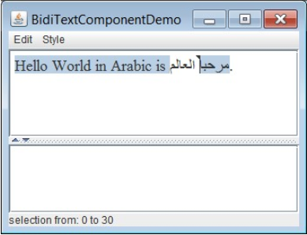

# 使用 JTextComponent 类处理双向文本

本节讨论如何使用 JTextComponent 类处理双向文本。双向文本是指包含按 **从左到右** 和 **从右到左** 两个方向运行的文本。双向文本的一个例子是阿拉伯文本(从右到左)，其中包含数字(从左到右)。双向文本的显示和管理更加困难;然而，JTextComponent 为您处理这些问题。

本节涵盖以下主题：

- 确定双向文本的方向性
- 显示和移动 Carets
- 命中测试
- 突出显示选择
- 设置组件方向

先上完整代码，上完，你不一定会看，因为还是很复杂的，完成了小型编辑器的 UI 功能


```java
package com.java;


/*
 * BidiTextComponentDemo.java requires one additional file:
 *   DocumentSizeFilter.java
 */

import java.awt.*;
import java.awt.event.*;
import java.awt.font.TextAttribute;
import java.util.HashMap;
import java.util.Locale;

import javax.swing.*;
import javax.swing.text.*;
import javax.swing.event.*;
import javax.swing.undo.*;

public class BidiTextComponentDemo extends JFrame {
    JTextPane textPane;
    AbstractDocument doc;
    static final int MAX_CHARACTERS = 500;
    JTextArea changeLog;
    String newline = "\n";

    HashMap<Object, Action> actions;

    // undo helpers
    protected UndoAction undoAction;
    protected RedoAction redoAction;
    protected UndoManager undo = new UndoManager();

    public BidiTextComponentDemo() {
        super("BidiTextComponentDemo");

        // Create the text pane and configure it.
        textPane = new JTextPane();

        // The following statement specifies that the run direction of
        // the text contained in the JTextPane object is
        // right-to-left.
//    textPane.getDocument().putProperty(TextAttribute.RUN_DIRECTION,TextAttribute.RUN_DIRECTION_RTL);

        // The following statements specify that the component orientation
        // of the JTextPane object is based on the ar-SA locale. Consequently,
        // these statements also set the run direction of the text contained
        // in the JTextPane object right-to-left.
//    Locale arabicSaudiArabia = new Locale.Builder().setLanguage("ar").setRegion("SA").build();
//    textPane.setComponentOrientation(ComponentOrientation.getOrientation(arabicSaudiArabia));

        textPane.setCaretPosition(0);
        textPane.setMargin(new Insets(5, 5, 5, 5));
        StyledDocument styledDoc = textPane.getStyledDocument();
        if (styledDoc instanceof AbstractDocument) {
            doc = (AbstractDocument) styledDoc;
            doc.setDocumentFilter(new DocumentSizeFilter(MAX_CHARACTERS));
        } else {
            System.err.println("Text pane's document isn't an AbstractDocument!");
            System.exit(-1);
        }
        JScrollPane scrollPane = new JScrollPane(textPane);
        scrollPane.setPreferredSize(new Dimension(200, 100));

        // Create the text area for the status log and configure it.
        changeLog = new JTextArea(5, 30);
        changeLog.setEditable(false);
        JScrollPane scrollPaneForLog = new JScrollPane(changeLog);

        // Create a split pane for the change log and the text area.
        JSplitPane splitPane = new JSplitPane(JSplitPane.VERTICAL_SPLIT,
                scrollPane, scrollPaneForLog);
        splitPane.setOneTouchExpandable(true);

        // Create the status area.
        JPanel statusPane = new JPanel(new GridLayout(1, 1));
        CaretListenerLabel caretListenerLabel = new CaretListenerLabel(
                "Caret Status");
        statusPane.add(caretListenerLabel);

        // Add the components.
        getContentPane().add(splitPane, BorderLayout.CENTER);
        getContentPane().add(statusPane, BorderLayout.PAGE_END);

        // Set up the menu bar.
        actions = createActionTable(textPane);
        JMenu editMenu = createEditMenu();
        JMenu styleMenu = createStyleMenu();
        JMenuBar mb = new JMenuBar();
        mb.add(editMenu);
        mb.add(styleMenu);
        setJMenuBar(mb);

        // Add some key bindings.
        addBindings();

        // Put the initial text into the text pane.
        initDocument();
        textPane.setCaretPosition(0);

        // Start watching for undoable edits and caret changes.
        doc.addUndoableEditListener(new MyUndoableEditListener());
        textPane.addCaretListener(caretListenerLabel);
        doc.addDocumentListener(new MyDocumentListener());
    }

    // This listens for and reports caret movements.
    protected class CaretListenerLabel extends JLabel implements CaretListener {
        public CaretListenerLabel(String label) {
            super(label);
        }

        // Might not be invoked from the event dispatch thread.
        public void caretUpdate(CaretEvent e) {
            displaySelectionInfo(e.getDot(), e.getMark());
        }

        // This method can be invoked from any thread. It
        // invokes the setText and modelToView methods, which
        // must run on the event dispatch thread. We use
        // invokeLater to schedule the code for execution
        // on the event dispatch thread.
        protected void displaySelectionInfo(final int dot, final int mark) {
            SwingUtilities.invokeLater(new Runnable() {
                public void run() {
                    if (dot == mark) { // no selection
                        try {
                            Rectangle caretCoords = textPane.modelToView(dot);
                            // Convert it to view coordinates.
                            setText("caret: text position: " + dot + ", view location = ["
                                    + caretCoords.x + ", " + caretCoords.y + "]" + newline);
                        } catch (BadLocationException ble) {
                            setText("caret: text position: " + dot + newline);
                        }
                    } else if (dot < mark) {
                        setText("selection from: " + dot + " to " + mark + newline);
                    } else {
                        setText("selection from: " + mark + " to " + dot + newline);
                    }
                }
            });
        }
    }

    // This one listens for edits that can be undone.
    protected class MyUndoableEditListener implements UndoableEditListener {
        public void undoableEditHappened(UndoableEditEvent e) {
            // Remember the edit and update the menus.
            undo.addEdit(e.getEdit());
            undoAction.updateUndoState();
            redoAction.updateRedoState();
        }
    }

    // And this one listens for any changes to the document.
    protected class MyDocumentListener implements DocumentListener {
        public void insertUpdate(DocumentEvent e) {
            displayEditInfo(e);
        }

        public void removeUpdate(DocumentEvent e) {
            displayEditInfo(e);
        }

        public void changedUpdate(DocumentEvent e) {
            displayEditInfo(e);
        }

        private void displayEditInfo(DocumentEvent e) {
            Document document = e.getDocument();
            int changeLength = e.getLength();
            changeLog.append(e.getType().toString() + ": " + changeLength
                    + " character" + ((changeLength == 1) ? ". " : "s. ")
                    + " Text length = " + document.getLength() + "." + newline);
        }
    }

    // Add a couple of emacs key bindings for navigation.
    protected void addBindings() {
        InputMap inputMap = textPane.getInputMap();

        // Ctrl-b to go backward one character
        KeyStroke key = KeyStroke.getKeyStroke(KeyEvent.VK_B, Event.CTRL_MASK);
        inputMap.put(key, DefaultEditorKit.backwardAction);

        // Ctrl-f to go forward one character
        key = KeyStroke.getKeyStroke(KeyEvent.VK_F, Event.CTRL_MASK);
        inputMap.put(key, DefaultEditorKit.forwardAction);

        // Ctrl-p to go up one line
        key = KeyStroke.getKeyStroke(KeyEvent.VK_P, Event.CTRL_MASK);
        inputMap.put(key, DefaultEditorKit.upAction);

        // Ctrl-n to go down one line
        key = KeyStroke.getKeyStroke(KeyEvent.VK_N, Event.CTRL_MASK);
        inputMap.put(key, DefaultEditorKit.downAction);
    }

    // Create the edit menu.
    protected JMenu createEditMenu() {
        JMenu menu = new JMenu("Edit");

        // Undo and redo are actions of our own creation.
        undoAction = new UndoAction();
        menu.add(undoAction);

        redoAction = new RedoAction();
        menu.add(redoAction);

        menu.addSeparator();

        // These actions come from the default editor kit.
        // Get the ones we want and stick them in the menu.
        menu.add(getActionByName(DefaultEditorKit.cutAction));
        menu.add(getActionByName(DefaultEditorKit.copyAction));
        menu.add(getActionByName(DefaultEditorKit.pasteAction));

        menu.addSeparator();

        menu.add(getActionByName(DefaultEditorKit.selectAllAction));
        return menu;
    }

    // Create the style menu.
    protected JMenu createStyleMenu() {
        JMenu menu = new JMenu("Style");

        Action action = new StyledEditorKit.BoldAction();
        action.putValue(Action.NAME, "Bold");
        menu.add(action);

        action = new StyledEditorKit.ItalicAction();
        action.putValue(Action.NAME, "Italic");
        menu.add(action);

        action = new StyledEditorKit.UnderlineAction();
        action.putValue(Action.NAME, "Underline");
        menu.add(action);

        menu.addSeparator();

        menu.add(new StyledEditorKit.FontSizeAction("12", 12));
        menu.add(new StyledEditorKit.FontSizeAction("14", 14));
        menu.add(new StyledEditorKit.FontSizeAction("18", 18));

        menu.addSeparator();

        menu.add(new StyledEditorKit.FontFamilyAction("Serif", "Serif"));
        menu.add(new StyledEditorKit.FontFamilyAction("SansSerif", "SansSerif"));

        menu.addSeparator();

        menu.add(new StyledEditorKit.ForegroundAction("Red", Color.red));
        menu.add(new StyledEditorKit.ForegroundAction("Green", Color.green));
        menu.add(new StyledEditorKit.ForegroundAction("Blue", Color.blue));
        menu.add(new StyledEditorKit.ForegroundAction("Black", Color.black));

        return menu;
    }

    protected void initDocument() {

        String bidiText = "Hello World in Arabic is " +
                "\u0645\u0631\u062D\u0628\u0627\u0020\u0627\u0644\u0639\u0627\u0644\u0645" +
                ".";

        String initString[] = {
                bidiText
        };

        SimpleAttributeSet[] attrs = initAttributes(initString.length);

        try {
            for (int i = 0; i < initString.length; i++) {
                doc.insertString(doc.getLength(), initString[i] + newline, attrs[i]);
            }

        } catch (BadLocationException ble) {
            System.err.println("Couldn't insert initial text.");
        }

    }

    protected SimpleAttributeSet[] initAttributes(int length) {

        SimpleAttributeSet[] attrs = new SimpleAttributeSet[length];

        attrs[0] = new SimpleAttributeSet();
        StyleConstants.setFontSize(attrs[0], 18);
        StyleConstants.setFontFamily(attrs[0], "Serif");

        return attrs;
    }

    // The following two methods allow us to find an
    // action provided by the editor kit by its name.
    private HashMap<Object, Action> createActionTable(JTextComponent textComponent) {
        HashMap<Object, Action> actions = new HashMap<Object, Action>();
        Action[] actionsArray = textComponent.getActions();
        for (int i = 0; i < actionsArray.length; i++) {
            Action a = actionsArray[i];
            actions.put(a.getValue(Action.NAME), a);
        }
        return actions;
    }

    private Action getActionByName(String name) {
        return actions.get(name);
    }

    class UndoAction extends AbstractAction {
        public UndoAction() {
            super("Undo");
            setEnabled(false);
        }

        public void actionPerformed(ActionEvent e) {
            try {
                undo.undo();
            } catch (CannotUndoException ex) {
                System.out.println("Unable to undo: " + ex);
                ex.printStackTrace();
            }
            updateUndoState();
            redoAction.updateRedoState();
        }

        protected void updateUndoState() {
            if (undo.canUndo()) {
                setEnabled(true);
                putValue(Action.NAME, undo.getUndoPresentationName());
            } else {
                setEnabled(false);
                putValue(Action.NAME, "Undo");
            }
        }
    }

    class RedoAction extends AbstractAction {
        public RedoAction() {
            super("Redo");
            setEnabled(false);
        }

        public void actionPerformed(ActionEvent e) {
            try {
                undo.redo();
            } catch (CannotRedoException ex) {
                System.out.println("Unable to redo: " + ex);
                ex.printStackTrace();
            }
            updateRedoState();
            undoAction.updateUndoState();
        }

        protected void updateRedoState() {
            if (undo.canRedo()) {
                setEnabled(true);
                putValue(Action.NAME, undo.getRedoPresentationName());
            } else {
                setEnabled(false);
                putValue(Action.NAME, "Redo");
            }
        }
    }

    /**
     * Create the GUI and show it. For thread safety, this method should be invoked from the event
     * dispatch thread.
     */
    private static void createAndShowGUI() {
        // Create and set up the window.
        final BidiTextComponentDemo frame = new BidiTextComponentDemo();
        frame.setDefaultCloseOperation(JFrame.EXIT_ON_CLOSE);

        // Display the window.
        frame.pack();
        frame.setVisible(true);
    }

    // The standard main method.
    public static void main(String[] args) {
        // Schedule a job for the event dispatch thread:
        // creating and showing this application's GUI.
        SwingUtilities.invokeLater(new Runnable() {
            public void run() {
                // Turn off metal's use of bold fonts
                UIManager.put("swing.boldMetal", Boolean.FALSE);
                createAndShowGUI();
            }
        });
    }
}
```

```java
package com.java;


/* A 1.4 class used by TextComponentDemo.java. */

import javax.swing.*;
import javax.swing.text.*;
import java.awt.Toolkit;

public class DocumentSizeFilter extends DocumentFilter {
    int maxCharacters;
    boolean DEBUG = false;

    public DocumentSizeFilter(int maxChars) {
        maxCharacters = maxChars;
    }

    public void insertString(FilterBypass fb, int offs,
                             String str, AttributeSet a)
            throws BadLocationException {
        if (DEBUG) {
            System.out.println("in DocumentSizeFilter's insertString method");
        }

        //This rejects the entire insertion if it would make
        //the contents too long. Another option would be
        //to truncate the inserted string so the contents
        //would be exactly maxCharacters in length.
        if ((fb.getDocument().getLength() + str.length()) <= maxCharacters)
            super.insertString(fb, offs, str, a);
        else
            Toolkit.getDefaultToolkit().beep();
    }

    public void replace(FilterBypass fb, int offs,
                        int length,
                        String str, AttributeSet a)
            throws BadLocationException {
        if (DEBUG) {
            System.out.println("in DocumentSizeFilter's replace method");
        }
        //This rejects the entire replacement if it would make
        //the contents too long. Another option would be
        //to truncate the replacement string so the contents
        //would be exactly maxCharacters in length.
        if ((fb.getDocument().getLength() + str.length()
                - length) <= maxCharacters)
            super.replace(fb, offs, length, str, a);
        else
            Toolkit.getDefaultToolkit().beep();
    }

}

```

以上代码来自该 [页面](https://docs.oracle.com/javase/tutorial/uiswing/examples/components/index.html#TextComponentDemo) 的示例

## 确定双向文本的方向性

您可以指定 JTextComponent 对象的 Document 对象的运行方向。例如，下面的语句指定了 JTextPane 对象 textPane 中的文本从右到左运行:

```java
textPane.getDocument().putProperty(
    TextAttribute.RUN_DIRECTION,
    TextAttribute.RUN_DIRECTION_RTL);
```

或者，您可以根据 Locale 指定特定 Swing 组件的组件方向。例如，下面的语句指定对象 textPane 的组件方向是基于 ar-SA 语言环境的：

```java
Locale arabicSaudiArabia = 
    new Locale.Builder().setLanguage("ar").setRegion("SA").build();
textPane.setComponentOrientation(
    ComponentOrientation.getOrientation(arabicSaudiArabia));
```

因为阿拉伯语的运行方向是从右到左，所以包含在 textPane 对象中的文本的运行方向也是从右到左。

## 显示和移动 Carets

在可编辑文本中，插入符号用于图形化地表示当前插入点，即文本中将插入新字符的位置。在 BidiTextComponentDemo.java 示例中，插入符号包含一个小三角形，它指向插入字符将显示的方向。

默认情况下，JTextComponent 对象创建一个 keymap(类型为 keymap)，它作为默认的 keymap 由所有JTextComponent 实例共享。键映射允许应用程序将击键与动作绑定。默认的键映射(用于支持插入符号移动的JTextComponent 对象)包括插入符号向前和向后移动与左右方向键之间的绑定，这支持通过双向文本进行插入符号移动。

## 命中测试

通常，设备空间中的位置必须转换为文本偏移量。例如，当用户在可选文本上单击鼠标时，鼠标的位置将转换为文本偏移量并用作选择范围的一端。从逻辑上讲，这与插入符号的位置相反。

可以将插入符号侦听器附加到 JTextComponent 的实例。插入符号侦听器使您能够处理插入符号事件，当插入符号移动或文本组件中的选择发生更改时发生插入符号事件。可以用 addCaretListener 方法附加一个插入符号侦听器。
有关更多信息，请参见如何编写 [插入符号侦听器](https://docs.oracle.com/javase/tutorial/uiswing/events/caretlistener.html)。

## 突出显示选择

选定的字符范围由高亮区域以图形方式表示，在高亮区域中，字形将以反向视频或不同的背景颜色显示。

JTextComponent 对象实现逻辑突出显示。这意味着选中的字符在文本模型中总是连续的，突出显示的区域允许不连续。下面是一个逻辑突出显示的例子:



## 设置组件方向

Swing 的布局管理器了解语言环境如何影响 UI;没有必要为每个语言环境创建新的布局。例如，在文本从右到左流动的区域设置中，布局管理器将以相同的方向排列组件。

....


::: tip

特别说明，此章，全部是机翻，因为笔者不学习 swing 图形相关知识，这是 [原文链接](https://docs.oracle.com/javase/tutorial/i18n/text/bidi.html)

:::