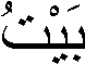

# 字符边界

如果应用程序允许最终用户 **高亮单个字符** 或在文本中 **一次移动一个字符**，则需要定位 **字符边界**。要创建一个定位字符边界的 BreakIterator，您需要调用 `getCharacterInstance` 方法，如下所示:

```java
BreakIterator characterIterator = BreakIterator.getCharacterInstance(currentLocale);
```

这种类型的 BreakIterator 检测用户字符之间的边界，而不仅仅是 Unicode 字符。

用户字符可以由多个 Unicode 字符组成。例如，用户字符 u 可以由 Unicode 字符 `\u0075 (u)` 和 `\u00a8(¨)` 组合而成。但是，这并不是最好的示例，因为字符 u 也可以由单个 Unicode 字符 `\u00fc` 表示。我们将使用阿拉伯语作为一个更实际的例子。

在阿拉伯语中房子的意思是：

这个单词包含三个用户字符，但它由以下六个 Unicode 字符组成:

```java
String house = "\u0628" + "\u064e" + "\u064a" + "\u0652" + "\u067a" + "\u064f";
```

主字符串中位置 1、3 和 5 的 Unicode 字符是变音符号。阿拉伯语需要变音符号，因为它们可以改变单词的意思。
示例中的变音符号是非间隔字符，因为它们出现在基本字符之上。在阿拉伯文字处理程序中，不能针对字符串中的每个 Unicode 字符在屏幕上移动光标一次。相反，对于每个用户字符，您必须移动它一次，用户字符可能由多个Unicode 字符组成。因此，必须使用 BreakIterator 扫描字符串中的用户字符。

比如如下的程序，创建了一个阿拉伯语的字符边界扫描器，并调用了 listPositions 方法

```java
BreakIterator arCharIterator = BreakIterator.getCharacterInstance(new Locale ("ar","SA"));
listPositions (house, arCharIterator);
```

listPositions 方法使用一个 BreakIterator 来定位字符串中的字符边界。注意，使用 setText 方法为 BreakIterator 分配了一个特定的字符串。
程序用第一个方法检索第一个字符边界，然后调用下一个，直到返回常量 BreakIterator.DONE

```java
static void listPositions(String target, BreakIterator iterator) {
                
    iterator.setText(target);
    int boundary = iterator.first();

    while (boundary != BreakIterator.DONE) {
        System.out.println (boundary);
        boundary = iterator.next();
    }
}
```

listPositions 方法打印出字符串中用户字符的以下边界位置。请注意，变音符号(1,3,5) 的位置没有列出:

```
0
2
4
6
```

就是打印出了三个字，一个字一个注音符号：

1. 0~2 
2. 2~4
3. 4~6