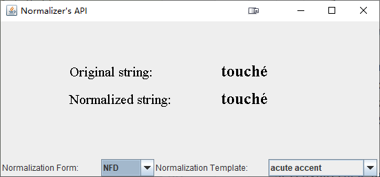

# 规范化文本

规范化是一个过程，通过这个过程，您可以执行文本的某些转换，以一种以前没有的方式使其可协调。比方说，您想 **搜索或排序** 文本，在本例中，您需要规范化该文本，以考虑应该表示为相同文本的码点。

什么可以标准化？当需要转换带有变音符号的字符、更改所有字母大小写、分解连缀或将半宽的片假名字符转换为全宽字符等时，可以使用这种规范化。

根据 [Unicode Standard Annex #15](http://www.unicode.org/reports/tr15/)，Normalizer 的 API 支持 [`java.text.Normalizer.Form`](https://docs.oracle.com/javase/8/docs/api/java/text/Normalizer.Form.html)  中定义的所有以下四种 Unicode 文本规范化形式：

- Normalization Form D (NFD)：规范分解
- Normalization Form C (NFC)：规范分解，然后是规范组合
- Normalization Form KD (NFKD)：兼容性分解
- Normalization Form KC (NFKC)：兼容性分解，然后是规范组合

让我们来看看拉丁字母「o」是如何通过使用这些标准化形式进行标准化的：

| Original word | NFC     | NFD           | NFKC    | NFKD          |
| ------------- | ------- | ------------- | ------- | ------------- |
| "schön"       | "schön" | "scho\u0308n" | "schön" | "scho\u0308n" |

您可以注意到，原始的单词在 NFC 和 NFKC 中没有改变。这是因为使用 NFD 和 NFKD，复合字符被映射到它们的规范分解。但是使用 NFC 和 NFKC，如果可能的话，组合字符序列会被映射到复合字符中。由于没有复合材料，只能在 NFC 和 NFKC 中进行分解。

在代码示例中，您还可以注意到另一个规范化特性。半宽和全宽的片假名字符具有相同的兼容性分解，因此是兼容性当量。然而，它们不是标准的等价物。

为了确保您确实需要对文本进行规范化，您可以使用 isnormalization 方法来确定给定的 char 值序列是否已规范化。如果这个方法返回 false，这意味着你必须对这个序列进行规范化，你应该使用规范化方法，该方法根据指定的规范化形式对 char 值进行规范化。例如，要将文本转换为规范分解的形式，你必须使用以下标准化方法：

```java
normalized_string = Normalizer.normalize(target_chars, Normalizer.Form.NFD);
```

此外，normalize 方法将重音重新排列为适当的规范顺序，这样您就不必担心自己的重音重新排列。

下面的示例展示了一个应用程序，它使您能够选择标准化表单和模板进行标准化：

```java
import java.awt.*;
import java.applet.*;
import java.awt.event.*;
import java.text.Normalizer;

import javax.swing.*;

import java.util.*;

public class NormSample extends Applet {
    static final long serialVersionUID = 6607883013849198961L;
    JComboBox normalizationTemplate;
    JComboBox formComboBox;
    JComponent paintingComponent;
    HashMap<String, Normalizer.Form> formValues = new HashMap<String, Normalizer.Form>();
    HashMap<String, String> templateValues = new HashMap<String, String>();

    public static void main(String[] args) {

//creating an applete for normalization

        JFrame f = new JFrame("Normalizer's API");
        f.setDefaultCloseOperation(JFrame.EXIT_ON_CLOSE);
        NormSample applet = new NormSample();
        applet.init();
        f.add("Center", applet);
        f.pack();
        f.setVisible(true);
    }

    public void init() {

//preparing values for the normalization forms ComboBox

        formValues.put("NFC", Normalizer.Form.NFC);
        formValues.put("NFD", Normalizer.Form.NFD);
        formValues.put("NFKC", Normalizer.Form.NFKC);
        formValues.put("NFKD", Normalizer.Form.NFKD);

        formComboBox = new JComboBox();

        for (Iterator it = formValues.keySet().iterator(); it.hasNext(); ) {
            formComboBox.addItem((String) it.next());
        }

//preparing samples for normalization

        //text with the acute accent symbol
        templateValues.put("acute accent", "touch" + "\u00e9");

        //text with ligature
        templateValues.put("ligature", "a" + "\ufb03" + "ance");

        //text with the cedilla
        templateValues.put("cedilla", "fa" + "\u00e7" + "ade");

        //text with half-width katakana
        templateValues.put("half-width katakana", "\uff81\uff6e\uff7a\uff9a\uff70\uff84");

        normalizationTemplate = new JComboBox();

        for (Iterator it = templateValues.keySet().iterator(); it.hasNext(); ) {
            normalizationTemplate.addItem((String) it.next());
        }

//defining a component to output normalization results

        paintingComponent = new JComponent() {
            static final long serialVersionUID = -3725620407788489160L;

            public Dimension getSize() {
                return new Dimension(550, 200);
            }

            public Dimension getPreferredSize() {
                return new Dimension(550, 200);
            }

            public Dimension getMinimumSize() {
                return new Dimension(550, 200);
            }

            public void paint(Graphics g) {
                Graphics2D g2 = (Graphics2D) g;


                g2.setFont(new Font("Serif", Font.PLAIN, 20));
                g2.setColor(Color.BLACK);
                g2.drawString("Original string:", 100, 80);
                g2.drawString("Normalized string:", 100, 120);
                g2.setFont(new Font("Serif", Font.BOLD, 24));


//output of the original sample selected from the ComboBox

                String original_string = templateValues.get(normalizationTemplate.getSelectedItem());
                g2.drawString(original_string, 320, 80);

//normalization and output of the normalized string

                String normalized_string;
                java.text.Normalizer.Form currentForm = formValues.get(formComboBox.getSelectedItem());
                normalized_string = Normalizer.normalize(original_string, currentForm);
                g2.drawString(normalized_string, 320, 120);
            }
        };
        setLayout(new BoxLayout(this, BoxLayout.Y_AXIS));
        add(paintingComponent);
        JPanel controls = new JPanel();

        controls.setLayout(new BoxLayout(controls, BoxLayout.X_AXIS));
        controls.add(new Label("Normalization Form: "));
        controls.add(formComboBox);
        controls.add(new Label("Normalization Template:"));
        controls.add(normalizationTemplate);
        add(controls);
        formComboBox.addActionListener(new ActionListener() {
            public void actionPerformed(ActionEvent e) {
                paintingComponent.repaint();
            }
        });

        normalizationTemplate.addActionListener(new ActionListener() {
            public void actionPerformed(ActionEvent e) {
                paintingComponent.repaint();
            }
        });
    }
}

```

上面这个程序代码运行之后，出现一个界面程序，然后查看原始字符，通过规范化之后，的一个对比

