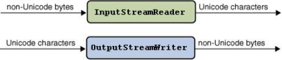

# 字符和字节流

java.io 包提供的类允许您在 Unicode 字符流和非 Unicode 文本的字节流之间进行转换。使用 InputStreamReader 类，您可以将字节流转换为字符流。使用 OutputStreamWriter 类将字符流转换为字节流。转换过程如下图所示:



在创建 InputStreamReader 和 OutputStreamWriter 对象时，指定要转换的字节编码。例如，要将 UTF-8 编码的文本文件转换为 Unicode，需要创建一个 InputStreamReader，如下所示:

```java
FileInputStream fis = new FileInputStream("test.txt");
InputStreamReader isr = new InputStreamReader(fis, "UTF8");
```

如果您 **省略了编码标识符**，InputStreamReader 和 OutputStreamWriter 将 **依赖于默认编码**。通过调用 `getEncoding` 方法，您可以确定 InputStreamReader 或 OutputStreamWriter 使用哪种编码，如下所示：

```java
InputStreamReader defaultReader = new InputStreamReader(fis);
String defaultEncoding = defaultReader.getEncoding();
```

下面的示例向您展示了如何使用 InputStreamReader 和 OutputStreamWriter 类执行字符集转换。这个示例显示日文字符。在尝试之前，请验证是否在您的系统上安装了适当的字体。如果您使用的 JDK 软件与 1.1 版本兼容，请复制 font.properties.ja 替换 font.properties 文件

将字符串对象中的 Unicode 字符序列转换为用 UTF-8 编码的 FileOutputStream 字节。执行转换的方法是 writeOutput：

```java
static void writeOutput(String str) {
    try {
        FileOutputStream fos = new FileOutputStream("test.txt");
        Writer out = new OutputStreamWriter(fos, "UTF8");
        out.write(str);
        out.close();
    } 
    catch (IOException e) {
        e.printStackTrace();
    }
}
```

readInput 方法从 writeOutput 方法创建的文件中读取 UTF-8 编码的字节。InputStreamReader 对象将字节从UTF-8 转换为 Unicode，并以字符串形式返回结果。readInput 方法如下:

```java
static String readInput() {
    StringBuffer buffer = new StringBuffer();
    try {
        FileInputStream fis = new FileInputStream("test.txt");
        InputStreamReader isr = new InputStreamReader(fis, "UTF8");
        Reader in = new BufferedReader(isr);
        int ch;
        while ((ch = in.read()) > -1) {
            buffer.append((char)ch);
        }
        in.close();
        return buffer.toString();
    } 
    catch (IOException e) {
        e.printStackTrace();
        return null;
    }
}
```

测试用例如下

```java
public static void main(String[] args) {
    String jaString = new String("\u65e5\u672c\u8a9e\u6587\u5b57\u5217");
    // 先把这个 unicode 字符串以 utf8 写出到文件
    writeOutput(jaString); 
    
    // 然后以 utf8 读出来，变成 unicode 
    String inputString = readInput();
    String displayString = jaString + " " + inputString;
    new ShowString(displayString, "Conversion Demo");
}
```

完整程序如下

```java

import java.io.*;
import java.util.*;

public class StreamConverter {

    static void writeOutput(String str) {

        try {
            FileOutputStream fos = new FileOutputStream("test.txt");
            Writer out = new OutputStreamWriter(fos, "UTF8");
            out.write(str);
            out.close();
        } catch (IOException e) {
            e.printStackTrace();
        }
    }

    static String readInput() {

        StringBuffer buffer = new StringBuffer();
        try {
            FileInputStream fis = new FileInputStream("test.txt");
            InputStreamReader isr = new InputStreamReader(fis, "UTF8");
            Reader in = new BufferedReader(isr);
            int ch;
            while ((ch = in.read()) > -1) {
                buffer.append((char)ch);
            }
            in.close();
            return buffer.toString();
        } catch (IOException e) {
            e.printStackTrace();
            return null;
        }
    }

    public static void main(String[] args) {

        String jaString  =
                new String("\u65e5\u672c\u8a9e\u6587\u5b57\u5217");

        writeOutput(jaString);
        String inputString = readInput();
        String displayString = jaString + " " + inputString;
        System.out.println(displayString);
        // 这个使用 awt 图形界面显示文本消息的这里就不贴出来了。直接打印下结果
//        new ShowString(displayString, "Conversion Demo");
    }

}

```

输出结果是

```
日本語文字列 日本語文字列
```

