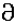
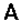
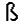
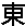

# 术语（terminology）

- **字符（character ）** 是具有语义价值的文本的 **最小单位**。

- **字符集（character set）** 是可被多种语言使用的 **字符的集合**。

  例如，拉丁字符集用于英语和大多数欧洲语言，而希腊语字符集仅用于希腊语。

- **编码字符集（coded character ）** 是一个字符集，其中每个字符被分配一个 **唯一的数字**。

- **码点（code point）** 是一个可以在 **编码字符集** 中使用的 **值**。

  码点是一个 32 位 int 数据类型，下面的 21 位代表一个有效的 **码点值**，上面的 11 位是 0。

- **Unicode 代码单元 （Unicode code unit）**  是一个 16 位的字符值。

  例如，假设一个字符串包含字母 `“abc”`，后跟  Deseret LONG I （），它用两个 char 值表示。该字符串包含  **四个字符**，**四个码点**，**但有五个代码单元**。

要在 Unicode 中表示字符，十六进制值的前缀是字符串 `U+`。

- Unicode 标准的有效码点范围是 `U+0000` 到`U+10FFFF`(包括在内)。
- 拉丁字符 A 的码点值是 `U+0041`。
- 代表欧元货币的字符 `€` 的码点值为 `U+20AC`。
- Deseret 字母表中的第一个字母 LONG I，有编码点值 `U+10400`。

下表显示了几个字符的码点值：

| Character                 | Unicode Code Point | Glyph                                                        |
| ------------------------- | ------------------ | ------------------------------------------------------------ |
| Latin（拉丁文） A         | U+0041             |  |
| Latin sharp（拉丁夏普） S | U+00DF             |  |
| 汉字 东                   | U+6771             |  |
| Deseret, LONG I           | U+10400            |  |

如前所述，在 `U+10000` 到 `U+10FFFF` 范围内的字符称为 **补充字符**。从 `U+0000` 到 `U+FFFF` 的字符集有时被称为 **基本多语言平面(BMP)**。

可以在  [更多信息](https://docs.oracle.com/javase/tutorial/i18n/text/info.html)  页面上列出的 Unicode 术语表中找到更多术语。