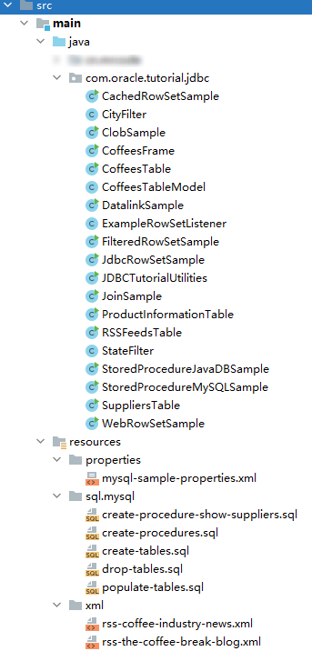

# 入门指南

本教程附带的示例代码创建了一个数据库，供名为 The coffee Break 的小咖啡馆的所有者使用。在这家咖啡馆，咖啡豆按磅出售，煮好的咖啡按杯出售。

::: tip

注意：本教程将不会教你如何搭建一个开发环境，因为您能看到这里，说明您已经是一个 java 入门者了。

由于官网这一章节的教程，有很多工具等都是比较落后的，甚至很多年都已经不在世面上存在了。

所以本章，将会安装笔者现在的开发知识进行讲解。最主要的无非是创建一个 maven 或则 gradle 的 java 项目，引用 mysql 驱动包。

改造完成后的代码文件和结构，会在此文章末尾附上完整代码，可以先按照目录结构在本地创建好项目，然后在阅读的时候，可以运行测试。

:::

以下步骤配置一个 JDBC 开发环境，您可以使用它编译和运行教程示例：

1. 在计算机上安装最新版本的 Java SE SDK
2. 如果需要，安装数据库管理系统（DBMS）
3. 从数据库供应商安装 JDBC 驱动程序
4. 安装 Gradle 6.x 版本
5. 下载示例代码
6. 笔者本次使用到项目文件规划

## 1. 在计算机上安装最新版本的 Java SE SDK

在计算机上安装最新版本的 Java SE SDK。确保环境变量中包含 Java SE SDK `bin` 目录的完整目录路径，`PATH `以便您可以从任何目录运行 Java 编译器和 Java 应用程序启动器。

## 2. 如果需要，安装数据库管理系统（DBMS）

您可以使用 Java DB，它是最新版本的 Java SE SDK 附带的。本教程已经测试了以下 DBMS：

- [Java DB](http://www.oracle.com/technetwork/java/javadb/overview/index.html)：别考虑这个了。2015 年 6 月开始，JavaDB 不再包含在最新版本的 JDK 中。
- [MySQL](http://www.mysql.com/)

注意，如果您使用的是另一个 DBMS，那么您可能必须修改教程示例的代码。

## 3. 从数据库供应商安装 JDBC 驱动程序

使用 MySQL 在这里获取驱动包 [Connector/J](http://www.mysql.com/products/connector/)。

JDBC 驱动程序有许多可能的实现。这些实现分类如下：

- Type 1：将 JDBC API 实现为映射到另一个数据访问 API（如 ODBC （开放数据库连接））的驱动程序。这种类型的驱动程序通常依赖于本机库，这限制了它们的可移植性。JDBC-ODBC 桥是 Type 1 驱动程序的一个示例。

  注意：应该将 JDBC-ODBC 桥视为一种过渡性解决方案。Oracle 不支持它。考虑仅在 DBMS 不提供只支持 java的 JDBC 驱动程序时使用它。

- Type 2：部分用 Java 编程语言和部分用本机代码编写的驱动程序。这些驱动程序使用特定于它们所连接的数据源的本地客户端库。同样，由于本机代码的存在，它们的可移植性受到了限制。Oracle 的 OCI （Oracle Call Interface）客户端驱动程序是 Type 2 驱动程序的一个示例。

- Type 3：使用纯 Java 客户机并使用与数据库无关的协议与中间件服务器通信的驱动程序。然后，中间件服务器将客户机的请求传递给数据源。

- Type 4：纯 Java 驱动程序，为特定数据源实现网络协议。客户端直接连接到数据源。

检查您的 DBMS 附带了哪些驱动程序类型。Java DB 附带了两个 Type 4 驱动程序，一个嵌入式驱动程序和一个网络客户端驱动程序。MySQL Connector/J 是一个 Type 4 驱动程序。

安装 JDBC 驱动程序通常包括将驱动程序复制到您的计算机，然后将其位置添加到您的类路径中。此外，除了 Type 4 驱动程序之外，许多 JDBC 驱动程序都需要安装客户端 API。通常不需要其他特殊配置。

## 4. 安装 Gradle 6.x 版本

不会教你如何安装，可以使用您自己熟悉的 maven 之类的来构建 java 项目

## 5. 下载示例代码

你可以不下载此示例，笔者会在讲解过程中，逐步的贴出来。

可以下载官方给定的压缩包，但是笔者不准备这样做，笔者会下载压缩包，并挑选出 mysql 相关的文件，并使用 idea + greadle 来构建这个练习项目

示例代码  [JDBCTutorial.zip](https://docs.oracle.com/javase/tutorial/jdbc/basics/examples/zipfiles/JDBCTutorial.zip) 文件，由以下文件组成：

- ```
  properties
  ```

  - `javadb-build-properties.xml`
  - `javadb-sample-properties.xml`
  - `mysql-build-properties.xml`
  - `mysql-sample-properties.xml`

- ```
  sql
  ```

  - ```
    javadb
    ```

    - `create-procedures.sql`
    - `create-tables.sql`
    - `drop-tables.sql`
    - `populate-tables.sql`

  - ```
    mysql
    ```

    - `create-procedures.sql`
    - `create-tables.sql`
    - `drop-tables.sql`
    - `populate-tables.sql`

- ```
  src/com/oracle/tutorial/jdbc
  ```

  - `CachedRowSetSample.java`
  - `CityFilter.java`
  - `ClobSample.java`
  - `CoffeesFrame.java`
  - `CoffeesTable.java`
  - `CoffeesTableModel.java`
  - `DatalinkSample.java`
  - `ExampleRowSetListener.java`
  - `FilteredRowSetSample.java`
  - `JdbcRowSetSample.java`
  - `JDBCTutorialUtilities.java`
  - `JoinSample.java`
  - `ProductInformationTable.java`
  - `RSSFeedsTable.java`
  - `StateFilter.java`
  - `StoredProcedureJavaDBSample.java`
  - `StoredProcedureMySQLSample.java`
  - `SuppliersTable.java`
  - `WebRowSetSample.java`

- ```
  txt
  ```

  - `colombian-description.txt`

- ```
  xml
  ```

  - `rss-coffee-industry-news.xml`
  - `rss-the-coffee-break-blog.xml`

- `build.xml`

创建一个目录来包含示例的所有文件。这些步骤将此目录称为 `<JDBC tutorial 目录>`。将 JDBCTutorial.zip 解压缩到 `<JDBC tutorial目录>` 中。

##  笔者本次使用到项目文件规划

研究了一下这个示例代码  [JDBCTutorial.zip](https://docs.oracle.com/javase/tutorial/jdbc/basics/examples/zipfiles/JDBCTutorial.zip) 文件，其实不用作太多的改变，用到的文件如下图



另外依赖包管理使用的 gradle，mysql 的依赖为 `compile('mysql:mysql-connector-java:5.1.46')`，数据库用的 Mysql 5.7

本次使用 Idea 工具，只留下了如上图的文件，下面大概将讲解下每个类/文件的大概作用。

- ```
  src/main/java/com/oracle/tutorial/jdbc
  ```

  - `CachedRowSetSample.java`
  - `CityFilter.java`
  - `ClobSample.java`
  - `CoffeesFrame.java`
  - `CoffeesTable.java`：对该表的 CRUD 操作
  - `CoffeesTableModel.java`
  - `DatalinkSample.java`
  - `ExampleRowSetListener.java`
  - `FilteredRowSetSample.java`
  - `JdbcRowSetSample.java`
  - `JDBCTutorialUtilities.java`：该教程用到的一些公共的工具方法
  - `JoinSample.java`
  - `ProductInformationTable.java`
  - `RSSFeedsTable.java`：对该表的 CRUD 操作
  - `StateFilter.java`
  - `StoredProcedureMySQLSample.java`
  - `SuppliersTable.java`：对该表的 CRUD 操作
  - `WebRowSetSample.java`
  
- ```
  properties
  ```

  - `mysql-sample-properties.xml`：存放 mysql 数据源的一些信息，如用户名、密码、ip 等信息

- ```
  xml
  ```

  - `rss-coffee-industry-news.xml`
  - `rss-the-coffee-break-blog.xml`

- ```
  sql
  ```
  
  - ```
    mysql	sql 脚本
    ```
  
    - `create-procedures.sql`	：创建存储过程的脚本
    - `create-tables.sql` ：创建所有用到的表的脚本
    - `drop-tables.sql` ：删除所有用到的表的脚本
    - `populate-tables.sql`：插入测试数据的脚本
  
  脚本可能只是为了方便看全貌和 sql 语句，因为每个类里面基本上都写部分语句

以上文件，为了以防万一，这里在本章对应的 Github 仓库中 `docs/jdbc/basics/project` 目录下也封存了一份（已经修改为后面说的比较方便运行的方式），如有需要，请自行前往该仓库中获取这些文件。也可以直接下载官方的压缩包，自己根据修改，因为并不复杂

关于如何运行测试说明：

1. 首先我们要将 `mysql-sample-properties.xml` 中的信息改成我们自己准备好的 mysql 数据库信息

2. 比如后面章节有说某一段代码来自  `SuppliersTable.createTable` 方法

   那么你首先要找到 `SuppliersTable` 这个类，里面有一个 main 方法，如下面这个

   ```java
       public static void main(String[] args) {
           // 我们改成固定的路径，因为只针对 mysql 测试
           final URL resource = JDBCTutorialUtilities.class.getResource("/properties/mysql-sample-properties.xml");
           String propertiesFileName = resource.getPath();
   
           JDBCTutorialUtilities myJDBCTutorialUtilities;
           Connection myConnection = null;
           if (propertiesFileName == null) {
               System.err.println("Properties file not specified at command line");
               return;
           } else {
               try {
                   // 这里去解析配置文件
                   myJDBCTutorialUtilities = new JDBCTutorialUtilities(propertiesFileName);
               } catch (Exception e) {
                   System.err.println("Problem reading properties file " + propertiesFileName);
                   e.printStackTrace();
                   return;
               }
           }
           try {
               // 通过 DriverManager.getConnection 获取一个连接，里面用到的信息就是上面解析的 xml 中的文件
               // 由于是 JDBC 4.0 后的 数据源，所以 DriverManager 会自动扫描在类路径下的 java.sql.Driver 实现类
               // 这里就会自动加载 mysql 驱动包中的 com.mysql.jdbc.Driver 类
               myConnection = myJDBCTutorialUtilities.getConnection();
   
               // Java DB does not have an SQL create database command; it does require createDatabase
   //      JDBCTutorialUtilities.createDatabase(myConnection,
   //                                           myJDBCTutorialUtilities.dbName,
   //                                           myJDBCTutorialUtilities.dbms);
   //
   //      JDBCTutorialUtilities.initializeTables(myConnection,
   //                                             myJDBCTutorialUtilities.dbName,
   //                                             myJDBCTutorialUtilities.dbms);
   
               // 为了测试创建表的 SQL ，我们这里按照该方法调用方式，新创建了该类，然后调用它
               final SuppliersTable suppliersTable = new SuppliersTable(myConnection, myJDBCTutorialUtilities.dbName, myJDBCTutorialUtilities.dbms);
               // 创建表
               suppliersTable.createTable();
               // 填充测试数据
               suppliersTable.populateTable();
               // 这里创建表，和测试数据这些，在 com.oracle.tutorial.jdbc.JDBCTutorialUtilities.initializeTables 中都有一个统一的初始化操作
               // 所以，只是为了自己尝试的时候在这里临时写上
   
               System.out.println("\nContents of SUPPLIERS table:");
               SuppliersTable.viewTable(myConnection);
   
   
           } catch (SQLException e) {
               JDBCTutorialUtilities.printSQLException(e);
           } finally {
               JDBCTutorialUtilities.closeConnection(myConnection);
           }
       }
   ```

   每个 man 方法里面都有一些初始化的代码，我们找到对应的地方，然后调用我们的测试方法即可，并把其他不需要测试的先注释掉，运行就可以测试了。